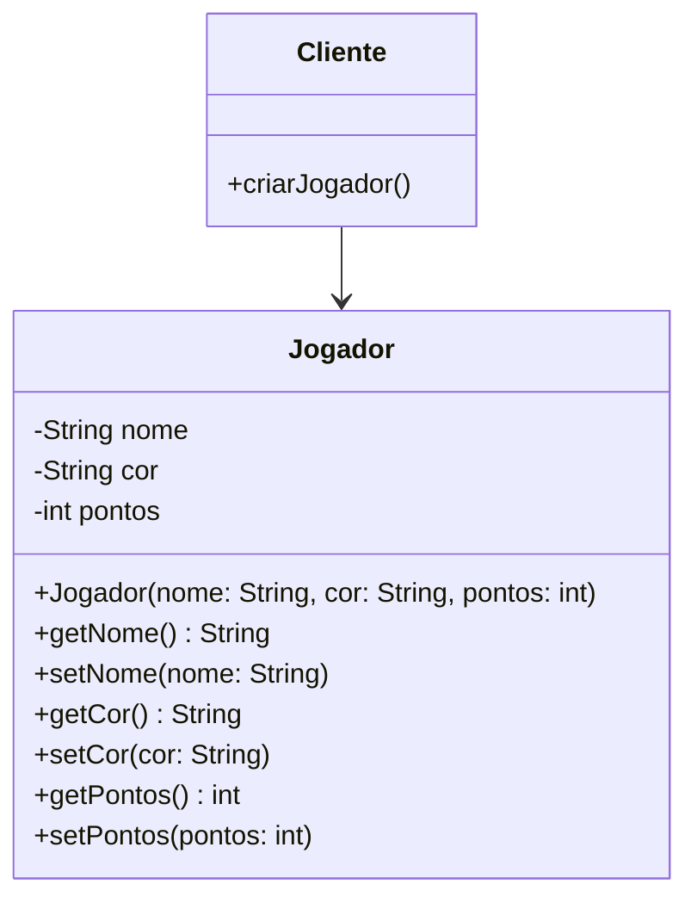
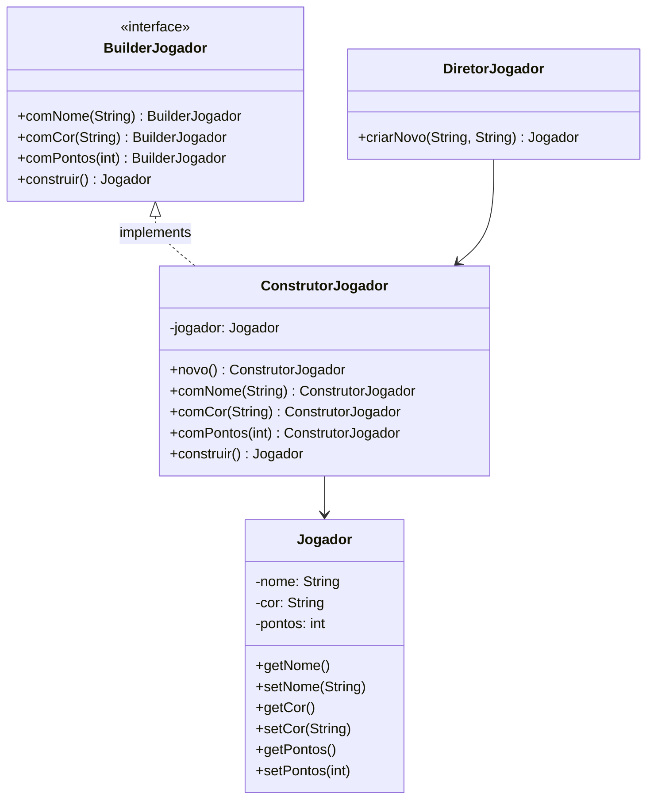

# Padrão Builder

## Intenção
O padrão Builder tem como objetivo principal simplificar a construção de objetos complexos que exigem múltiplos parâmetros, alguns obrigatórios e outros opcionais. 
Em vez de depender de construtores sobrecarregados ou métodos setters que podem deixar o objeto em estado inconsistente, o Builder oferece uma abordagem mais organizada e segura. 
Ele permite configurar o objeto passo a passo, garantindo que todas as validações necessárias sejam aplicadas antes que a instância final seja criada.

## Motivação
Na construção de sistemas de jogos, frequentemente nos deparamos com a necessidade de criar objetos complexos como personagens jogáveis. 
Esses objetos geralmente possuem uma variedade de atributos, alguns essenciais e outros opcionais, cada um com suas próprias regras de validação.
O principal desafio surge quando tentamos criar esses objetos usando abordagens convencionais. Construtores com múltiplos parâmetros rapidamente se tornam difíceis de gerenciar e entender. 
Imagine um construtor que precise aceitar nome, cor, pontos iniciais, nível, habilidades especiais e equipamentos - rapidamente teríamos um método confuso e propenso a erros. 
Alternativas como usar setters após a criação também apresentam problemas, pois permitem que o objeto exista em estados inconsistentes durante sua construção.

### Cenário sem o Padrão

### Diagrama UML (Padrão)

## Participantes

- **Builder (BuilderJogador):** Define a interface para construir diferentes partes do objeto Jogador. Fornece os métodos abstratos para personalização (`comNome()`, `comCor()`, etc.).

- **ConcreteBuilder (ConstrutorJogador):** Aqui temos a implementação concreta do Builder. O ConstrutorJogador é encarregado de construir o objeto Jogador de fato. Ele mantém a representação do jogador em um atributo interno e oferece métodos específicos para configurar suas propriedades, como `comNome()`, `comCor()` e `comPontos()`. Após definir todas as características desejadas, o método `construir()` é chamado para retornar o objeto Jogador completamente configurado e pronto para uso.

- **Director (DiretorJogador):** Garante que os passos de construção sejam seguidos corretamente. Utiliza um Builder para criar um Jogador com configurações específicas.

- **Product (Jogador):** O objeto complexo que está sendo construído.
