 

# Padrões Criacionais

## 1. Builder

### Intenção
 Separar a construção de um objeto complexo da sua representação de modo que o
 mesmo processo de construção possa criar diferentes representações - `GOF`

### Motivação
Um problema que enfrentamos durante o desenvolvimento foi a criação do objeto Jogador, que exigia várias validações e etapas de configuração para garantir consistência. Era necessário assegurar que o nome e a cor fossem sempre válidos (não nulos ou vazios) e que os pontos não fossem negativos. Sem uma abordagem estruturada, acabamos com construtores sobrecarregados e código repetitivo de validação, além do risco de criar jogadores em estados inconsistentes, como sem nome ou cor definidos. 

Para resolver isso, adotamos o padrão Builder . Ele organiza a construção do Jogador em etapas claras, centralizando as validações no ConstrutorJogado. Com o DiretorJogador, conseguimos encapsular regras específicas de criação, tornando o processo mais flexível e reutilizável. Agora, o Builder garante que o Jogador seja sempre criado de forma válida, eliminando complexidades e reduzindo erros.
### Cenário sem a aplicação do padrão

**Diagrama UML (cenário sem o padrão):**

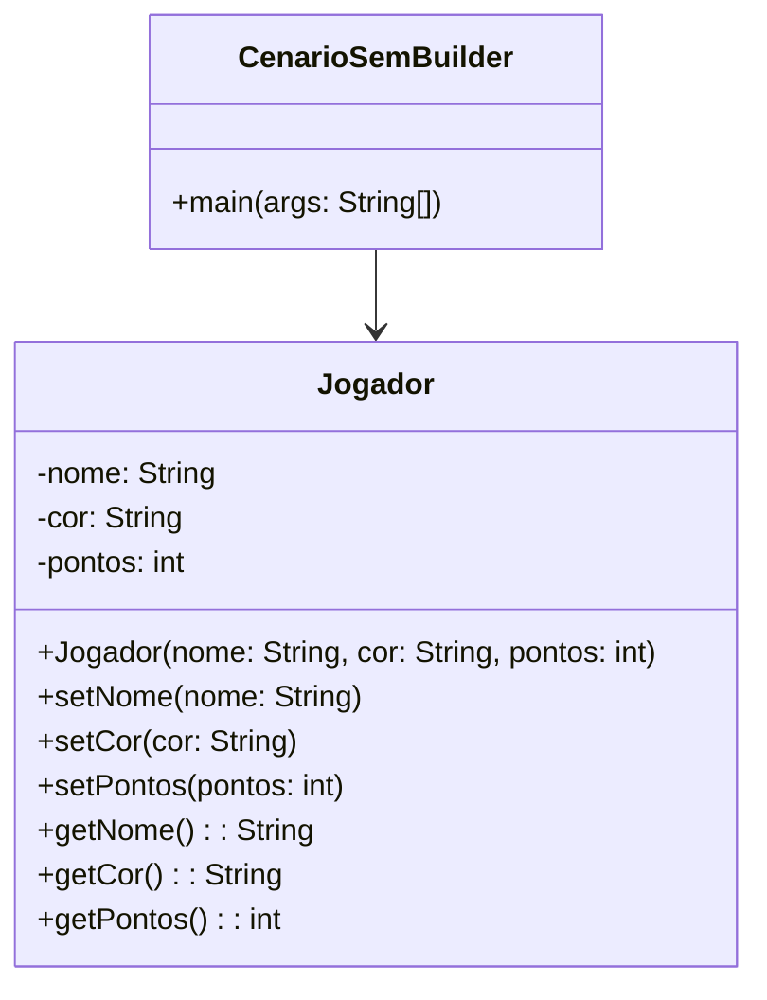

### Estrutura do padrão (GOF)


**Diagrama UML (cenário com o padrão):**

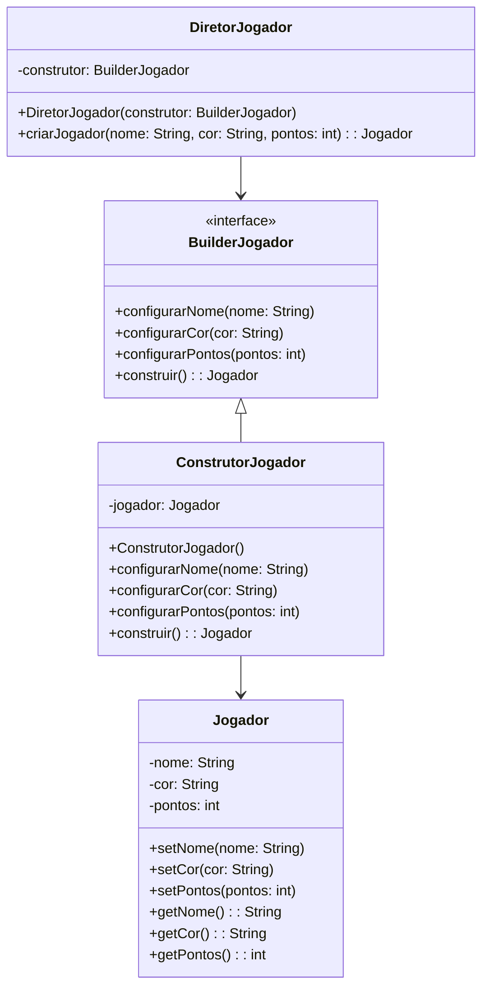

### Participantes
- **Builder (BuilderJogador):** Define a interface que define os métodos necessários para construir um Jogador.
- **ConcreteBuilder (ConstrutorJogador):** Implementa a interface BuilderJogador que é responsável por construir o Jogador.
- **Director (DiretorJogador):** Controla o processo de construção, o que garante que os passos sejam seguidos corretamente.
- **Product (Jogador):** O objeto complexo que está sendo construído.

### Descrição Textual
A interface BuilderJogador define os métodos necessários para a construção de um objeto Jogador em um jogo. Esta interface age como um contrato, especificando as operações fundamentais que um construtor de jogadores deve implementar.
Ela segue o princípio da separação de responsabilidades, isolando as ações de configuração e construção do jogador. Isso permite que diferentes implementações de BuilderJogador possam criar jogadores de formas variadas sem alterar a estrutura básica da classe Jogador (o produto que desejamos gerar).

A classe DiretorJogador é responsável por controlar o processo de construção de um jogador. Ela recebe uma instância de BuilderJogador e utiliza essa instância para construir jogadores conforme as regras específicas de configuração. 
O método criarJogador(String nome, String cor, int pontos) encapsula a lógica de criação de um jogador, garantindo que todas as etapas de configuração sejam executadas de forma consistente. Ele delega as chamadas de configuração para o BuilderJogador fornecido, permitindo que diferentes implementações de construtores possam ser usadas sem alterar o comportamento do diretor.

A classe ConstrutorJogador é uma implementação concreta da interface BuilderJogador. Esta classe implementa todos os métodos da interface e contém a lógica real para construir o objeto Jogador.
No método configurarNome, o nome do jogador é validado para garantir que não seja nulo ou vazio antes de ser atribuído. O método configurarCor realiza uma validação semelhante para a cor do jogador. Já o método configurarPontos verifica se os pontos são não negativos antes de serem atribuídos.

O método construir valida se o jogador possui tanto um nome quanto uma cor configurados antes de retornar o objeto construído. Essa validação garante que o jogador esteja em um estado consistente antes de ser utilizado.

Este padrão simplifica o processo de criação para o usuário final, que pode simplesmente chamar o método criarJogador e obter um jogador completamente configurado.

### Código (Framework)

**BuilderJogador.java**

```java
package builder;

import model.Jogador;

public interface BuilderJogador {
	void configurarNome(String nome);
	void configurarCor(String cor);
	void configurarPontos(int pontos);
	Jogador construir();
}
```

**DiretorJogador.java**

```java
package builder;

import model.Jogador;

public class DiretorJogador {

	private final ConstrutorJogador construtor;

	public DiretorJogador(ConstrutorJogador construtor) {
		this.construtor = construtor;
	}

	public Jogador criarJogador(String nome, String cor, int pontos) {
		construtor.configurarNome(nome);
		construtor.configurarCor(cor);
		construtor.configurarPontos(0);
		return construtor.construir();
	}
}
```
**ConstrutorJogador.java**
```java
package jogo.builder;

import framework.model.Jogador;
import framework.builder.BuilderJogador;

public class ConstrutorJogador implements BuilderJogador {
    private Jogador jogador;

    public ConstrutorJogador() {
        this.jogador = new Jogador();
    }

    @Override
    public void configurarNome(String nome) {
        if (nome == null || nome.isEmpty()) {
            throw new IllegalArgumentException("O nome do jogador não pode ser nulo ou vazio.");
        }
        jogador.setNome(nome);
    }

    @Override
    public void configurarCor(String cor) {
        if (cor == null || cor.isEmpty()) {
            throw new IllegalArgumentException("A cor do jogador não pode ser nula ou vazia.");
        }
        jogador.setCor(cor);
    }

    @Override
    public void configurarPontos(int pontos) {
        if (pontos < 0) {
            throw new IllegalArgumentException("Os pontos do jogador não podem ser negativos.");
        }
        jogador.setPontos(pontos);
    }

    @Override
    public Jogador construir() {
        if (this.jogador.getNome() == null || this.jogador.getCor() == null) {
            throw new IllegalStateException("Nome e cor são obrigatórios");
        }
        return jogador;
    }
}
```


### Código (Jogo): 

COLOCAR


## 2. Factory Method

### Intenção  
Definir uma interface para a criação de peças, permitindo que as subclasses decidam qual peça instanciar. Dessa maneira, a criação das peças ganha flexibilidade.

### Motivação
No desenvolvimento de um jogo, a criação direta de peças na classe principal gera problemas ao adicionar novos tipos de animais. Sem um padrão, o código acumula condicionais (if/else ou switch) para lidar com cada tipo, tornando-o rígido, acoplado e difícil de manter. 

O Factory Method  resolve isso encapsulando a lógica de criação em subclasses ou implementações específicas. Assim, novos tipos de peças podem ser adicionados sem alterar o código existente, apenas criando novas fábricas ou subclasses.

### Cenário sem a aplicação do padrão

Ao criar diferentes peças em um jogo, como leões, tigres ou ratos, o código pode ficar fortemente acoplado às classes concretas dessas peças:

O que acaba dificultando a manutenção e a expansão, tornando mais difícil mudar o comportamento da criação de peças no futuro, além de quebrar o princípio aberto-fechado.

**Diagrama UML (cenário sem o padrão):**

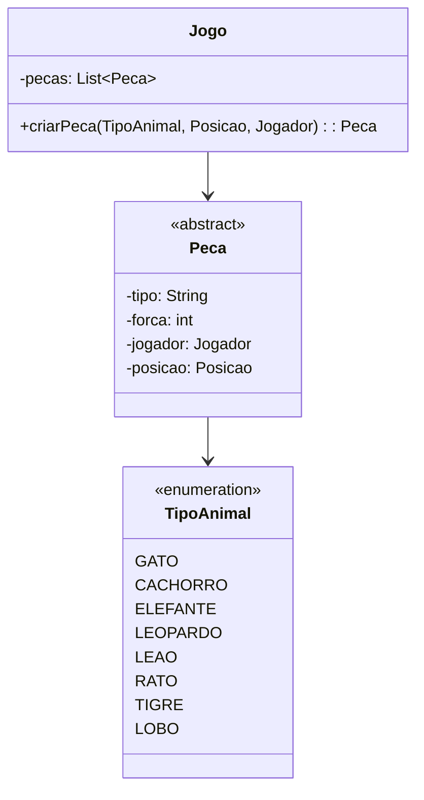
---

### Estrutura do padrão (GOF)


---

### Classes envolvidas

- CriadorPeca → Interface 
- FactoryMethodCriadorPeca → Interface especializada do método fábrica
- Peca → Produto
- Posicao, Jogador, TipoAnimal → Parâmetros utilizados na criação da peça

**Diagrama UML (cenário com o padrão):**

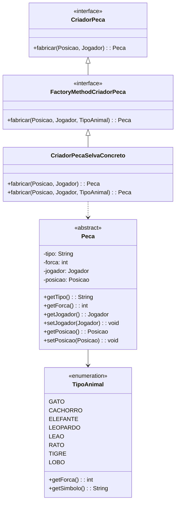

### Participantes
- **Creator (CriadorPeca):** Classe abstrata que define o método factory, deixando para a fábrica a responsabilidade de instanciá-la corretamente.
- **ConcreteCreator (CriadorPecaSelvaConcreto):** Implementação concreta de CriadorPeca, especializada na criação de peças do jogo.
- **Product (Peca):** Define o contrato básico para todas as peças do jogo. Ela garante que todas as peças possam ser tratadas de maneira uniforme, permitindo que o código que manipula as peças seja flexível e extensível.
- **Client:** Usa o método fábrica sem depender de implementações concretas das peças.
  
### Descrição textual

A interface CriadorPeca é a base para a criação de peças no jogo. Ela define um contrato que todas as classes criadoras de peças devem seguir, garantindo que cada peça seja criada com uma posição (Posicao) e um jogador (Jogador) associados. Essa abstração permite que o processo de criação de peças seja padronizado e desacoplado do restante do código. 

A interface FactoryMethodCriadorPeca estende CriadorPeca e adiciona um novo método fabricar, que inclui um parâmetro adicional: o tipo de animal (TipoAnimal). Essa extensão permite que as peças sejam criadas com características específicas, como força e comportamento, associadas ao tipo de animal correspondente. 

A classe CriadorPecaSelvaConcreto é uma implementação concreta da interface FactoryMethodCriadorPeca. Ela é responsável por criar peças específicas para o jogo Selva. O método fabricar(Posicao posicao, Jogador jogador) lança uma exceção caso seja chamado, pois exige que o tipo de animal seja especificado. Já o método fabricar(Posicao posicao, Jogador jogador, TipoAnimal tipoAnimal) cria uma instância da classe Animal, que representa uma peça do jogo com atributos como nome, força, jogador e posição. 
 
Se novas peças precisarem ser introduzidas no jogo, basta adicionar essas peças à fábrica, mantendo o restante do código desacoplado e organizado.


---

### Código (Framework)

**CriadorPeca.java**

```java
package framework.factoryMethod;

import framework.model.Jogador;
import framework.model.Posicao;
import framework.model.pecas.Peca;

public interface CriadorPeca {
    Peca fabricar(Posicao posicao, Jogador jogador);
}
```

**FactoryMethodCriadorPeca.java**

```java
package framework.factoryMethod;

import framework.model.Jogador;
import framework.model.Posicao;
import framework.model.pecas.Peca;
import framework.model.pecas.TipoAnimal;

public interface FactoryMethodCriadorPeca extends CriadorPeca {
    Peca fabricar(Posicao posicao, Jogador jogador, TipoAnimal animal);
}
```
**CriadorPecaSelvaConcreto.java**
```java
package jogo.factorymethod;

import framework.factoryMethod.FactoryMethodCriadorPeca;
import framework.model.Jogador;
import framework.model.Posicao;
import framework.model.pecas.Peca;
import framework.model.pecas.TipoAnimal;
import jogo.model.Animal;

public class CriadorPecaSelvaConcreto implements FactoryMethodCriadorPeca {

    @Override
    public Peca fabricar(Posicao posicao, Jogador jogador) {
        throw new UnsupportedOperationException("Método 'fabrica' não implementado: Parâmetros incorretos, é necessário definir o tipo do animal.");
    }

    @Override
    public Peca fabricar(Posicao posicao, Jogador jogador, TipoAnimal tipoAnimal) {
        return new Animal(tipoAnimal.toString(), tipoAnimal.getForca(), jogador, posicao);
    }
}
```
---

### Código (Jogo):

COLOCAR

## 3. Abstract Factory

### Intenção
Construir famílias de peças para cada jogador sem especificar suas classes concretas.

### Motivação
A implementação do padrão Abstract Factory na elaboração do framework de jogos é justificada pela demanda por flexibilidade e escalabilidade na elaboração de diversos jogos com estruturas similares, porém lógicas diferentes.  Jogos como Damas e Selva compartilham a ideia de peças em um tabuleiro, contudo, apresentam diferenças em termos de regras, aparência e comportamento. Através do Abstract Factory, conseguimos transformar essas variações em fábricas tangíveis, assegurando que as peças e o tabuleiro gerados estejam no mesmo contexto e sejam compatíveis entre si.  Isso favorece a unidade entre os componentes do jogo, simplifica a manutenção do código e possibilita a inclusão de novos jogos sem a exigência de modificar a estrutura básica do framework.  Assim, o padrão garante uma arquitetura limpa, genérica e flexível para diversas implementações.


### Cenário sem a aplicação do padrão

Sem a Abstract Factory, o processo de criação de peças e tabuleiro seria disperso pelo código principal, com condicionais específicas para cada tipo de peça ou estilo de jogo.  Isso provoca um forte vínculo e rompe o princípio de aberto-fechado.

**Diagrama UML (cenário sem o padrão):**

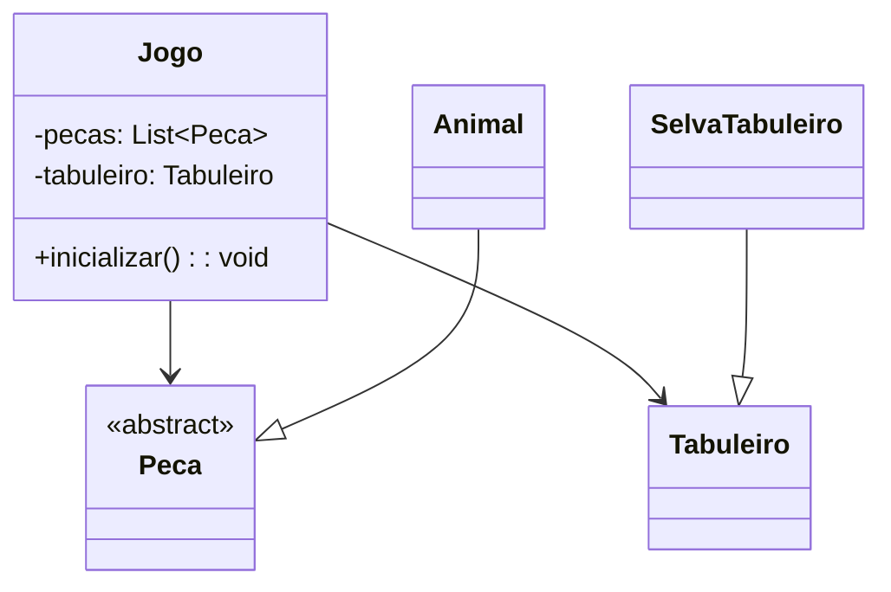

### Estrutura do padrão (GoF)


### Classes envolvidas

- **FabricaAbstrataJogo** → Interface da fábrica (AbstractFactory)
- **SelvaJogoFactory** → Implementação concreta da fábrica (ConcreteFactory)
- **Peca**, **Tabuleiro** → Interfaces dos produtos (AbstractProducts)
- **Animal**, **SelvaTabuleiro** → Implementações concretas dos produtos (ConcreteProducts)
## Padrão aplicado no cenário

**Diagrama UML (com o padrão aplicado):**

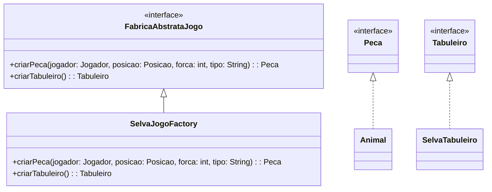

### Participantes
- **AbstractFactory (FabricaAbstratataJogo):** Define uma interface para criar uma família de peças e um tabuleiro.
- **ConcreteFactory (SelvaJogoFactory):** implementa as operações que criam objetos-produto concretos.
- **AbstractProduct (Peca, Tabuleiro):** declara uma interface para um tipo de objeto-produto
- **ConcreteProduct (Animal, SelvaTabuleiro):** implementa a interface de Abstract Product.

### Descrição textual
A classe FabricaAbstrataJogo é uma interface que define um contrato para a criação de componentes essenciais do jogo, como peças (Peca) e tabuleiros (Tabuleiro). Essa abstração permite que diferentes implementações concretas forneçam variações específicas desses componentes, garantindo flexibilidade e modularidade no design do jogo. 

No contexto do jogo Selva, a classe SelvaJogoFactory implementa a interface FabricaAbstrataJogo e é responsável por criar as peças e o tabuleiro específicos desse jogo. Através do método criarPeca, ela instancia peças do tipo Animal, que representam os elementos jogáveis do jogo, como gatos, cães, leões, etc. Já o método criarTabuleiro retorna uma instância de SelvaTabuleiro, que é uma adaptação específica para o tabuleiro do jogo Selva. 
 
Criação de Peças:
O método criarPeca da classe SelvaJogoFactory recebe parâmetros como o jogador associado à peça (Jogador), a posição inicial (Posicao), a força da peça (forca) e o tipo da peça (tipo). Com essas informações, ele cria uma instância de Animal, que encapsula as características e comportamentos das peças no jogo. 

Criação do Tabuleiro:
O método criarTabuleiro utiliza um adaptador (SelvaTabuleiroAdapter) para criar um tabuleiro específico para o jogo Selva. Esse adaptador é configurado com dimensões fixas (9x7) e encapsula a lógica necessária para gerenciar o estado do tabuleiro. A classe SelvaTabuleiro estende TabuleiroBase e utiliza o adaptador para interagir com o tabuleiro de forma adequada ao jogo. 
     

### Código (Framework)

**FabricaAbstrataJogo.java**
```java
package framework.abstractFactory;

import framework.model.Jogador;
import framework.model.Posicao;
import framework.model.Tabuleiro;
import framework.model.pecas.Peca;

public interface FabricaAbstrataJogo {
    Peca criarPeca(Jogador jogador, Posicao posicao, int forca, String tipo);
    Tabuleiro criarTabuleiro();
}
```

### Código (Jogo):


## 4. Singleton
### Intenção
Garantir que o tabuleiro contendo o jogo selva tenha somente uma instância e fornecer um ponto global de acesso para ele.

### Motivação
No desenvolvimento do jogo, surgiram problemas quando diferentes partes do sistema criaram suas próprias instâncias da classe ConfiguracaoJogo. Isso causou inconsistências, como tabuleiros de tamanhos diferentes entre a interface e a lógica do jogo, além de desperdício de recursos e dificuldade para manter as configurações sincronizadas. O Singleton resolveu esses problemas garantindo uma única instância global, eliminando conflitos e simplificando o controle das configurações do jogo.

### Diagrama UML (cenário sem o padrão)
```mermaid
classDiagram
    class ConfiguracaoJogo {
        - quantidadeMaximaJogador: int
        - larguraTabuleiro: int
        - alturaTabuleiro: int
        + ConfiguracaoJogo() 
        + getLarguraTabuleiro(): int
        + getAlturaTabuleiro(): int
        + getQuantidadeMaximaJogador(): int
        + setLarguraTabuleiro(larguraTabuleiro: int): void
        + setAlturaTabuleiro(alturaTabuleiro: int): void
        + setQuantidadeMaximaJogador(qtd: int): void
    }
 ```
### Diferenças em Relação ao Singleton
Sem Controle de Instância : Não há um método estático como getInstancia() nem um atributo estático para armazenar a única instância.
Múltiplas Instâncias : Qualquer parte do código pode criar novas instâncias da classe ConfiguracaoJogo.
Flexibilidade : Essa abordagem é mais flexível, mas perde a garantia de unicidade fornecida pelo Singleton.
     
## Estrutura do padrão (GOF)


### Diagrama UML (cenário com o padrão):
```mermaid
classDiagram
    class ConfiguracaoJogo {
        - instancia: ConfiguracaoJogo (static, volatile)
        - quantidadeMaximaJogador: int
        - larguraTabuleiro: int
        - alturaTabuleiro: int
        + getInstancia(): ConfiguracaoJogo (static)
        + getLarguraTabuleiro(): int
        + getAlturaTabuleiro(): int
        + getQuantidadeMaximaJogador(): int
        + setLarguraTabuleiro(larguraTabuleiro: int): void
        + setAlturaTabuleiro(alturaTabuleiro: int): void
        + setQuantidadeMaximaJogador(qtd: int): void
    }
```

### Participantes
- **Singleton(ConfiguracaoJogo):** Garante uma única instância de configuração global por jogo, com um construtor privado e o método getInstancia para acesso centralizado. Controla configurações como tamanho do tabuleiro e quantidade de jogadores, evitando inconsistências.
  
### Descrição Textual
A classe ConfiguracaoJogo foi criada para garantir que haja apenas uma instância global de configuração do jogo durante a execução. Para isso, o construtor é privado, impedindo que outras partes do código criem novas instâncias diretamente. A única instância é controlada pelo método getInstancia(), que usa um padrão thread-safe para garantir que funcione corretamente em ambientes multithread. 

Essa classe centraliza todas as configurações importantes do jogo, como o tamanho do tabuleiro (largura e altura) e a quantidade máxima de jogadores. Ela oferece métodos simples para acessar e alterar essas configurações sempre que necessário. Com essa abordagem, evita-se que diferentes partes do sistema usem configurações conflitantes ou desperdicem recursos criando múltiplas instâncias desnecessárias.


## 5. Prototype

## Intenção  
Especificar os tipos de objetos a serem criados usando uma instância prototípica e criar novos objetos copiando esse protótipo. – `GOF`


### Motivação

### Cenário sem a aplicação do padrão

A criação de peças exige configurações e estados complexos. Sem o uso do padrão Prototype, cada nova peça precisa ser criada do zero com todas as configurações, o que pode tornar o processo custoso em termos de desempenho e legibilidade:

```java
Peca tigre = new Tigre(new Posicao(2, 2), jogador);
```

 O que torna a duplicação de objetos semelhante mais difícil, especialmente quando eles compartilham a mesma configuração básica.

**Diagrama UML (cenário sem o padrão):**

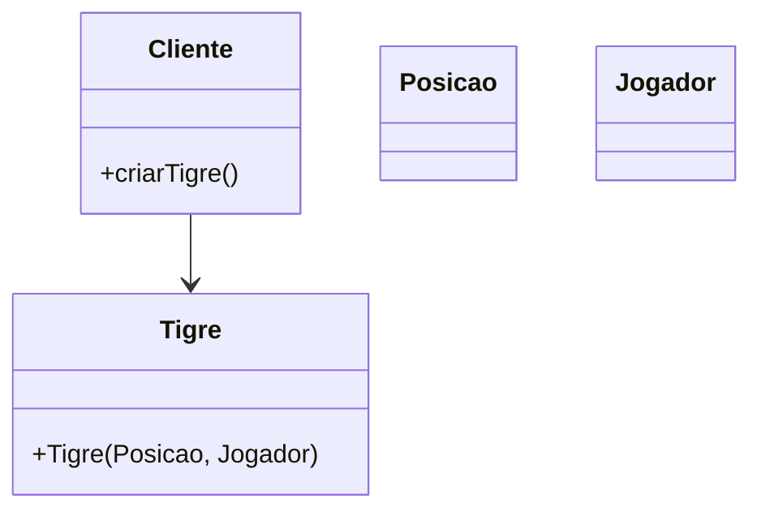


## Estrutura do padrão (GOF)


### Descrição textual

Com o padrão Prototype, definimos a interface PecaPrototype, que oferece um método clonar(). Cada peça concreta poderá ser clonada a partir de um protótipo existente, permitindo criar novos objetos com base em um modelo já configurado. Isso reduz o custo de criação e facilita a replicação de peças semelhantes com pequenas variações.

### Classes envolvidas

- PecaPrototype **-->**  Interface
- Posicao, Jogador **-->**  Parâmetros de estado
- Peças concretas **-->**  Protótipos clonáveis
- clonar() **-->**  Método principal para duplicar

**Diagrama UML (cenário com o padrão):**

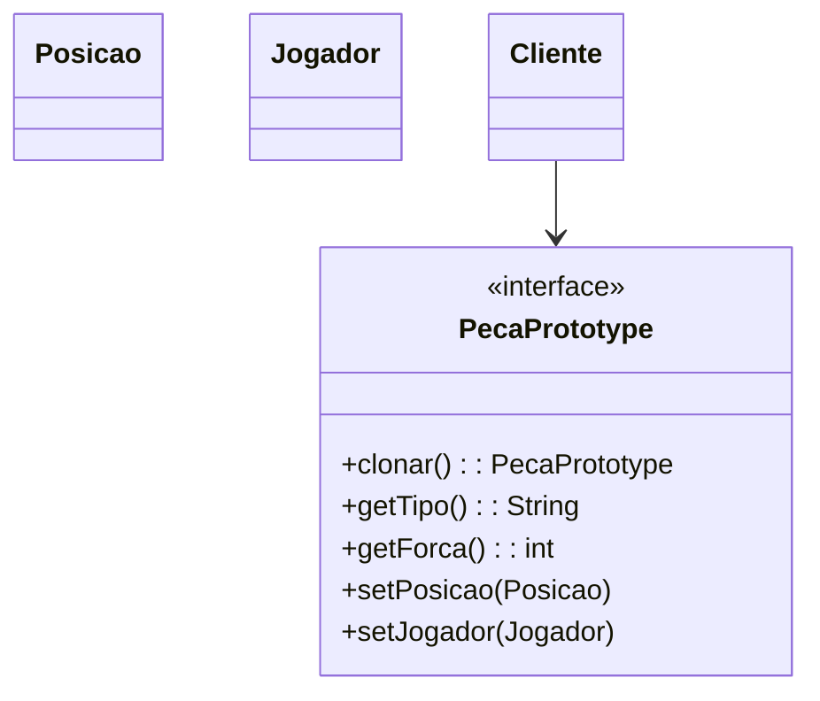

### Participantes
- **Prototype (PecaPrototype)** Interface para clonagem de si mesmo.
- **ConcretePrototype (ex: Tigre, Rato):** Implementa a clonagem de si mesmo, retornando uma nova instância com o mesmo estado.
- **Client:** Usa o protótipo para clonar novos objetos sem depender diretamente de suas classes concretas.


### Código (Framework)

**PecaPrototype.java**

```java
package framework.prototype;

import framework.model.Jogador;
import framework.model.Posicao;

public interface PecaPrototype extends Cloneable {
    PecaPrototype clonar();  
    String getTipo();      
    int getForca();
    void setPosicao(Posicao posicao);
    void setJogador(Jogador jogador);
}
```

### Código (Jogo):

COLOCAR

# Padrões Estruturais


## 6. Flyweight

### Intenção
Otimizar a criação e o gerenciamento de peças usando o padrão Flyweight economiza memória ao reutilizar instâncias de PecasJogador que compartilham o mesmo estado (cor). Em vez de criar múltiplas instâncias idênticas para peças do mesmo time, uma única instância é mantida no cache (FabricaPecasJogador) e compartilhada entre todas as peças com a mesma cor, como "branco" ou "preto". Isso reduz o uso de memória e simplifica o gerenciamento das peças no jogo.

### Motivação

**Diagrama UML (cenário sem o padrão):**

### Estrutura do padrão (GoF)


### Padrão aplicado no cenário

### Participantes


### Descrição Textual
No contexto do padrão Flyweight, a interface PecasJogador atua como a classe Flyweight, representando os atributos compartilhados entre as peças que podem ser reutilizados. Nesse caso, a cor do jogador ("preto" ou "branco") é o principal estado compartilhado, tornando essa interface a base comum para todas as instâncias que possuem características idênticas e que podem ser reutilizadas sem necessidade de criar novas instâncias.  

A FabricaPecasJogador é a Flyweight Factory, responsável por gerenciar as instâncias de PecasJogador. Ela garante que, para cada cor ("branco" ou "preto"), apenas uma instância de PecasBrancas ou PecasPretas será criada e compartilhada entre as peças. Ao solicitar uma peça com determinada cor, a fábrica verifica se já existe uma instância dessa cor em seu cache; se não, ela cria uma nova instância e a armazena para reutilização futura. Essa abordagem economiza recursos ao evitar a criação de múltiplas instâncias idênticas. 

Assim, a FabricaPecasJogador trabalha em conjunto com as classes PecasBrancas e PecasPretas para implementar o padrão Flyweight, garantindo que o estado compartilhado seja gerenciado de forma eficiente, enquanto o estado variável de cada peça (como tipo ou símbolo) seja tratado separadamente. 

## 7. Facade

### Intenção
Fornecer uma interface unificada para um conjunto de interfaces em um subsistema. O Facade define uma interface de nível mais alto que torna o subsistema mais fácil de usar. – `GoF`


### Motivação

### Cenário sem a aplicação do padrão

Sem o uso do padrão Facade, o código cliente precisa interagir diretamente com diversos componentes internos do jogo, como o controle de turnos, as regras de movimentação e captura. Isso gera um forte acoplamento e maior complexidade no código:

```java
if (peca.podeMover(destino) && regrasJogo.capturaValida(peca, inimigo)) {
    gerenciadorTurnos.proximoTurno();
}
```

Nesse cenário, o cliente precisa conhecer múltiplas classes e suas interações internas, o que torna a manutenção e a extensão do sistema mais difíceis.

**Diagrama UML (cenário sem o padrão):**

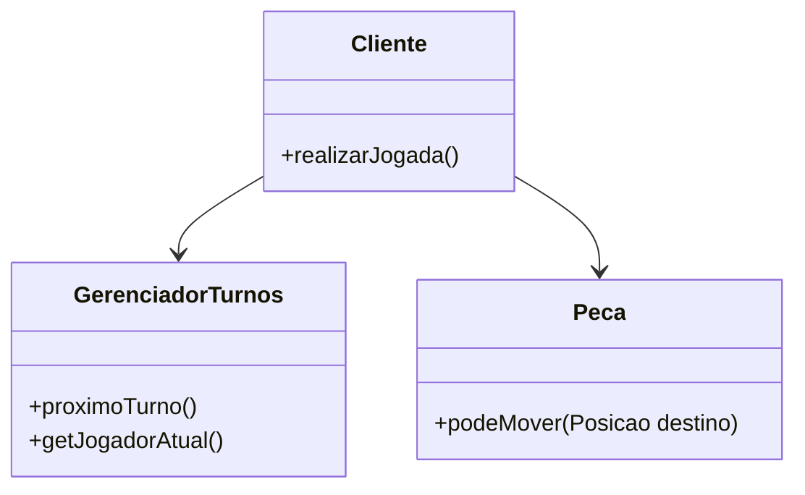


### Estrutura do padrão (GoF)


### Padrão aplicado no cenário

### Descrição textual

Ao aplicarmos o padrão Facade ao jogo Selva, criamos uma interface RegrasJogoFacade esta encapsula a lógica de movimentação, captura e controle de turnos. O cliente por sua vez ao invés de lidar com diversas classes diretamente, interage com essa fachada única.Reduzindo o acoplamento, melhorando a organização e facilitando modificações futuras.


### Classes envolvidas

- RegrasJogoFacade **-->** Interface
- RegrasJogoSelvaFacade **-->** Implementação concreta
- GerenciadorTurnos **-->** Subsistema interno de controle de turnos
- Peca, Posicao, Jogador **-->** Entidades do jogo que participam das regras

**Diagrama UML (cenário com o padrão):**

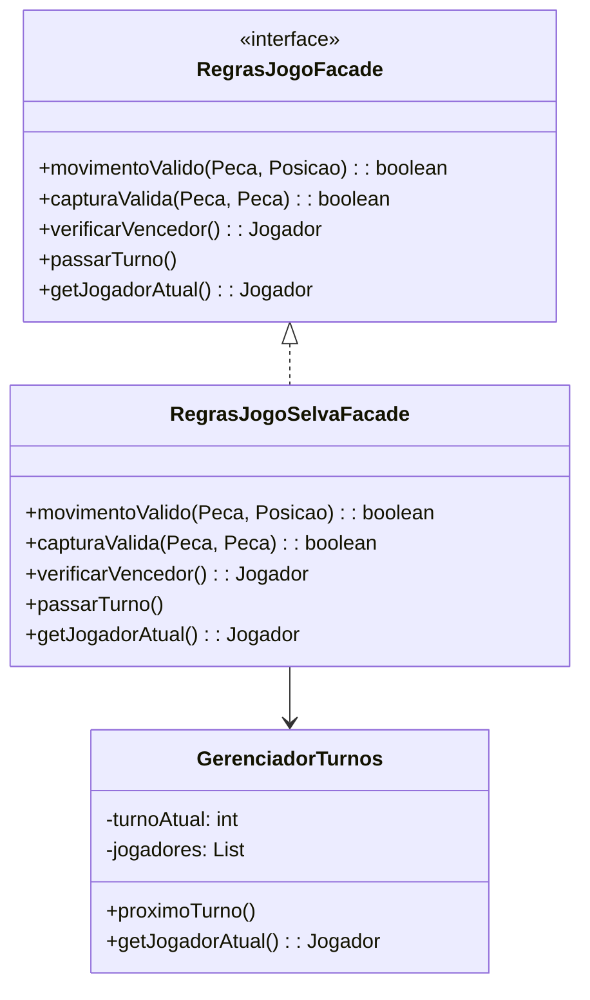


### Participantes
- **Facade (RegrasJogoFacade):** Interface unificada para operações de turno, movimento e regras do jogo.
- **ConcreteFacade (RegrasJogoSelvaFacade):** Implementação concreta da interface, orquestra as operações internas.
- **Subsistemas (GerenciadorTurnos, Peca):** Componentes internos encapsulados pela fachada.
- **Cliente:** Interage apenas com a fachada, sem conhecer os detalhes internos.

### Código

### Framework

**GerenciadorTurnos.java**

```java
package framework.facade;

import java.util.List;
import framework.model.Jogador;

public class GerenciadorTurnos {
    private int turnoAtual;
    private List<Jogador> jogadores;

    public GerenciadorTurnos(List<Jogador> jogadores) {
        if (jogadores == null || jogadores.isEmpty()) {
            throw new IllegalArgumentException("Lista de jogadores não pode ser vazia");
        }
        this.jogadores = jogadores; 
        this.turnoAtual = 0;
    }

    public void proximoTurno() {
        turnoAtual = (turnoAtual + 1) % jogadores.size();
    }

    public Jogador getJogadorAtual() {
        return jogadores.get(turnoAtual); 
    }
}
```

**RegrasJogoFacade.java**

```java
package framework.facade;

import framework.model.Jogador;
import framework.model.Posicao;
import framework.model.pecas.Peca;

public interface RegrasJogoFacade {
    boolean movimentoValido(Peca peca, Posicao destino);
    boolean capturaValida(Peca atacante, Peca defensor);
    Jogador verificarVencedor();
    void passarTurno();
    Jogador getJogadorAtual();
}
```

### Código (Jogo): 

COLOCAR

## 8. Adapter

### intenção
Converter a interface de uma classe em outra interface, esperada pelos clientes. O
Adapter permite que classes com interfaces incompatíveis trabalhem em conjunto, o que, de outra forma, seria impossível.

### Motivação
No processo de criação de jogos, diversas versões de tabuleiro (como Selva ou Damas) podem apresentar variações na maneira como lidam com terrenos, fronteiras e peças.  Em vez de adaptar a lógica do jogo para cada tipo de tabuleiro, desenvolvemos um Adapter que proporciona uma interface unificada. Assim, o jogo se relaciona com o TabuleiroAdapter, sem se ater às especificidades de cada tabuleiro em particular. isso incentiva a reutilização de código, o desapego e a incorporação de novos tipos de tabuleiros no framework.

### Cenário sem a aplicação do padrão
**Diagrama UML (sem o padrão):**

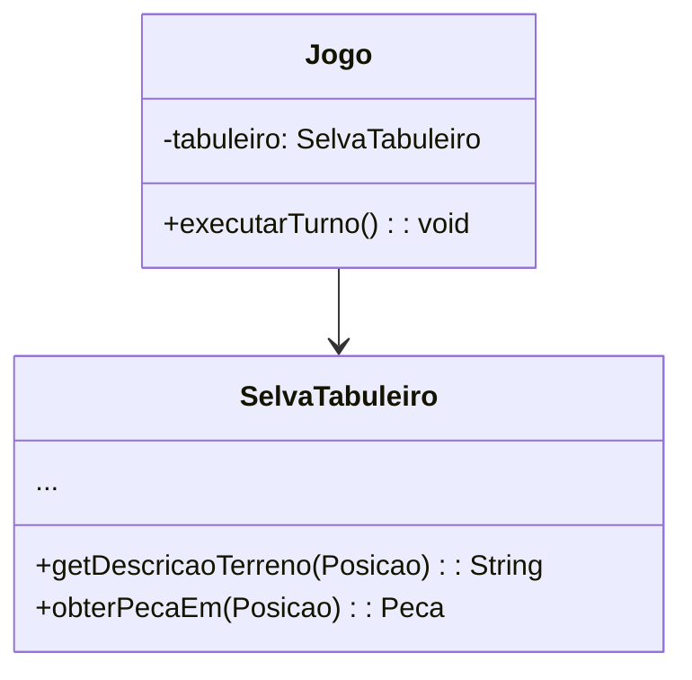

### Estrutura do padrão (GOF)


**Diagrama UML (com o padrão):**

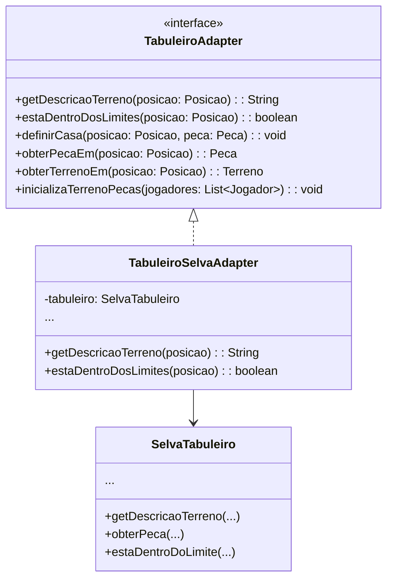

---

### Participantes

- **Target (TabuleiroAdapter):** Interface esperada pelo código cliente.
- **Adapter (TabuleiroSelvaAdapter):** Adapta a interface do tabuleiro real para a interface esperada.
- **Adaptee (SelvaTabuleiro):** Classe existente com uma interface original e específica.
- **Client (Lógica do jogo):** Usa o TabuleiroAdapter para interagir com qualquer tipo de tabuleiro.

---

### Descrição textual

A interface TabuleiroAdapter estabelece os procedimentos esperados pelo framework para manipular o tabuleiro do jogo, como a obtenção de peças, a verificação de terrenos ou a verificação de fronteiras.  Isso possibilita que o framework permaneça genérico, operando com qualquer plataforma que possua essa interface.
 
 O adapter é uma implementação tangível da classe TabuleiroSelvaAdapter.  Ela tem uma representação do SelvaTabuleiro e converte cada chamada à interface prevista (TabuleiroAdapter) para as operações efetivas do SelvaTabuleiro.  Este procedimento de tradução garante que o restante do código opere sem alterações, independentemente da variação na estrutura do tabuleiro entre os jogos.

---

### Código (Framework)

**TabuleiroAdapter.java**
```java
package framework.adapter;

import java.util.List;
import framework.model.Jogador;
import framework.model.Posicao;
import framework.model.Terreno;
import framework.model.pecas.Peca;

public interface TabuleiroAdapter {
    String getDescricaoTerreno(Posicao posicao);
    boolean estaDentroDosLimites(Posicao posicao);
    void definirCasa(Posicao posicao, Peca peca);
    Peca obterPecaEm(Posicao posicao);
    Terreno obterTerrenoEm(Posicao posicao);
    void inicializaTerrenoPecas(List<Jogador> jogadores);
}
```

### Código (Jogo)


# Padrões Comportamentais
    
## 9. State

### Intenção
Permite a um objeto alterar seu comportamento quando o seu estado interno muda. No contexto desse framework, o comportamento da movimentação de peças será alterado para só permitir que a peça do jogador atual seja movida.

### Motivação
Em jogos de turno, é necessário controlar qual jogador pode executar ações em determinado momento. Usar estruturas condicionais (if, switch) espalhadas pelo código para verificar o jogador atual torna o sistema rígido e difícil de manter. Com o padrão State, encapsulamos os comportamentos de cada estado em classes específicas, permitindo que o jogo altere dinamicamente seu comportamento ao mudar o estado atual.

### Cenário sem a aplicação do padrão
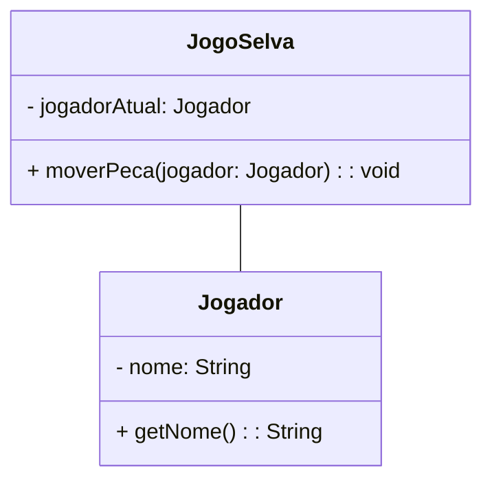

### Estrutura do padrão (GOF)


### Padrão aplicado no cenário
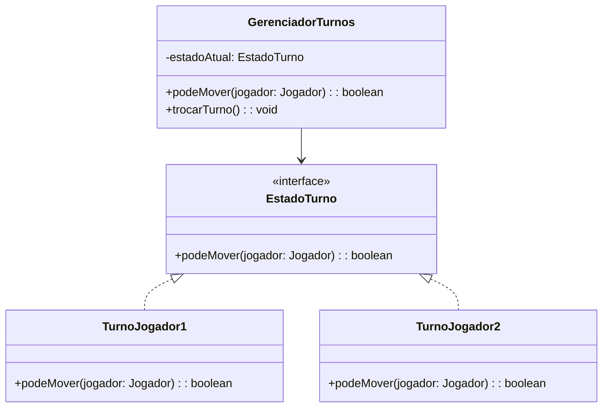

### Participantes
- **Context (GerenciadorTurnos):** Armazena a referência para o estado atual e delega a ele o comportamento.
- **State (EstadoTurno):** Define uma interface para encapsulamento comum para todos os estados.
- **ConcreteStates (TurnoJogador1, TurnoJogador2):** Implementa o comportamento específico para cada um dos jogadores, garantindo que cada jogador consiga mover apenas as suas peças.

### Descrição textual
O GerenciadorTurnos mantém um estadoAtual, que define qual jogador está ativo.
Quando um jogador tenta mover uma peça, o método podeMover(jogador) do estado atual decide se ele pode ou não jogar.
Ao fim de uma jogada válida, o método trocarTurno() altera o estado atual para o outro jogador.

### Código (Framework)

**EstadoTurno.java**
```java
public interface EstadoTurno {
    boolean podeMover(Jogador jogador);
}
```

**TurnoJogador1.java**
```java
public class TurnoJogador1 implements EstadoTurno {
    @Override
    public boolean podeMover(Jogador jogador) {
        return jogador.getId() == 1;
    }
}
```

**TurnoJogador2.java**
```java
public class TurnoJogador2 implements EstadoTurno {
    @Override
    public boolean podeMover(Jogador jogador) {
        return jogador.getId() == 2;
    }
}
```

**GerenciadorTurnos.java**
```java
public class GerenciadorTurnos {
    private EstadoTurno estadoAtual;

    public GerenciadorTurnos() {
        this.estadoAtual = new TurnoJogador1();
    }

    public boolean podeMover(Jogador jogador) {
        return estadoAtual.podeMover(jogador);
    }

    public void trocarTurno() {
        if (estadoAtual instanceof TurnoJogador1) {
            estadoAtual = new TurnoJogador2();
        } else {
            estadoAtual = new TurnoJogador1();
        }
    }
}
```

## 10. Strategy
### Intenção
Permitir de maneira simples a variação dos algoritmos utilizados na resolução de um determinado problema. No contexto desse framework, o Strategy está sendo utilizado para alterar o comportamento mover() do elefante e do rato, que possuem características de movimento e captura especiais.

### Motivação

### Cenário sem a aplicação do padrão


### Estrutura do padrão (GOF)


### Padrão aplicado no cenário


## 11. Command
## Intenção
Controlar as chamadas a um determinado componente, no contexto desse framework, a movimentação, modelando cada requisição como um objeto. Permitir que as operações possam ser desfeitas, enfileiradas ou registradas.

## Motivação
Ao desenvolver um framework para jogos de tabuleiro, como o jogo Selva, surgiu a necessidade de permitir que os jogadores desfaçam ou refaçam suas jogadas. Sem o padrão Command, a implementação dessas funcionalidades seria problemática, pois a lógica de desfazer e refazer ficaria diretamente acoplada à classe Jogador, dificultando a adição de novas ações e tornando o código confuso e propenso a erros. Além disso, gerenciar manualmente o histórico de todas as ações comprometeria a modularidade do sistema, impedindo sua reutilização em outros jogos ou contextos. O padrão Command  resolve esses problemas ao encapsular cada ação, como mover uma peça, em objetos independentes. Isso permite gerenciar o histórico de forma simples e organizada, facilitando a implementação de desfazer e refazer, além de tornar o sistema mais extensível e reutilizável.

### Cenário sem a aplicação do padrão
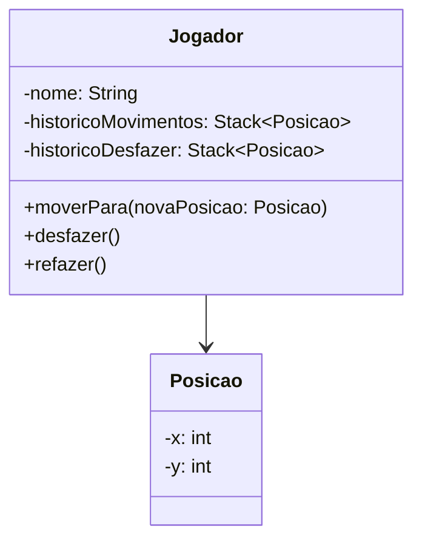

### Estrutura do padrão (GOF)

### Padrão aplicado no cenário

### Participantes
- **Command (Command):** Define a interface comum para todos os comandos, com os métodos execute, undo e redo.
- **ConcreteCommand (MoverCommand):** Implementa os comandos execute, executar e desfazer, referenciando o Jogador e Peca.
- **Receiver (Jogador e Peca):** Realiza as operações reais que o comando abstrai.
- **Invoker (GerenciadorComandos):** Armazena e executa os comandos. Ele chama o executar() no comando e mantém uma lista para desfazer as ações.

 
## Descrição textual
No código do jogo, o Command foi implementado para gerenciar os movimentos das peças no tabuleiro de forma que possam ser facilmente desfeitos e refeitos.

A classe MoverCommand representa o comando específico para movimentar uma peça, interagindo com a classe Jogador e Peca, que atua como o receiver. A lógica de movimentação real da peça é realizada pelo Jogador, enquanto a Peca mantém sua posição no tabuleiro. Essa abstração permite que o jogo seja mais flexível e que o histórico de movimentos seja controlado.

O GerenciadorComandos atua como o invoker, utilizando uma pilha para gerenciar a execução e desfazer ações conforme necessário, proporcionando um controle eficiente do fluxo do jogo e das interações dos jogadores.

Com essa arquitetura, o jogo consegue facilmente reverter um movimento incorreto ou aplicar o conceito de redo para refazer uma jogada desfeita, o que melhora a experiência de usabilidade e a organização do código.

### Código (Framework)
**Command.java**

``` java
package framework.command;

public interface Command {
    void executar();
    void desfazer(); 
}
```
**MoverCommand.java**
``` java
package framework.command;

import framework.facade.GerenciadorTurnos;
import framework.model.Jogador;
import framework.model.Posicao;
import framework.model.pecas.Peca;

public class MoverCommand implements Command {
    private final Jogador jogador;
    private final Posicao novaPosicao;
    private Posicao posicaoAnterior;
    private final Peca peca;
    private final GerenciadorTurnos gerenciadorTurnos;

    public MoverCommand(Jogador jogador, Posicao novaPosicao, Peca peca, GerenciadorTurnos gerenciadorTurnos) {
        this.jogador = jogador;
        this.novaPosicao = novaPosicao;
        this.peca = peca;
        this.gerenciadorTurnos = gerenciadorTurnos;
    }

    @Override
    public void executar() {
        if (!gerenciadorTurnos.podeMover(jogador)) {
            System.out.println("Não é o turno desse jogador!");
            return;
        }

        this.posicaoAnterior = peca.getPosicao(); // Salva a posição atual antes de mover
        jogador.moverPara(novaPosicao, peca);     // Move a peça
        gerenciadorTurnos.proximoTurno();         // Avança para o próximo turno
    }

    @Override
    public void desfazer() {
        jogador.voltarPara(posicaoAnterior, peca); // Retorna à posição anterior
    }
}
```

**GerenciadorComandos.java**

``` java
package framework.command;

import java.util.Stack;

public class GerenciadorComandos {
    private Stack<Command> historicoExecucao = new Stack<>();
    private Stack<Command> historicoDesfazer = new Stack<>();

    public void executarComando(Command comando) {
        comando.executar();
        historicoExecucao.push(comando); // Adiciona ao histórico de execução
        historicoDesfazer.clear();       // Limpa o histórico de refazer
    }

    public void desfazer() {
        if (!historicoExecucao.isEmpty()) {
            Command comando = historicoExecucao.pop();
            comando.desfazer();
            historicoDesfazer.push(comando); // Adiciona ao histórico de refazer
        } else {
            System.out.println("Nada para desfazer.");
        }
    }

    public void refazer() {
        if (!historicoDesfazer.isEmpty()) {
            Command comando = historicoDesfazer.pop();
            comando.executar();
            historicoExecucao.push(comando); // Adiciona novamente ao histórico de execução
        } else {
            System.out.println("Nada para refazer.");
        }
    }
}

``` 
## 12. Memento

### Intenção 
Sem violar o encapsulamento, salvar e carregar um estado interno de um objeto, de maneira que o objeto possa ser restaurado para esse estado mais tarde.

### Motivação
No jogo, salvar e restaurar o estado do tabuleiro (como as peças e o jogador atual) exigiria expor detalhes internos do Tabuleiro para outras classes, violando o encapsulamento. Além disso, gerenciar múltiplos estados salvos de forma manual seria confuso, propenso a erros e dificultaria implementar funcionalidades como "desfazer" ou "refazer". O padrão Memento resolve esses problemas ao permitir que o Tabuleiro crie um objeto Memento para armazenar seu estado interno de forma segura e protegida. O Caretaker assume a responsabilidade de gerenciar os estados salvos, organizando-os em uma pilha. Dessa forma, o Tabuleiro mantém total controle sobre seu estado, enquanto o Caretaker simplifica o gerenciamento de múltiplos estados.

### Cenário sem a aplicação do padrão
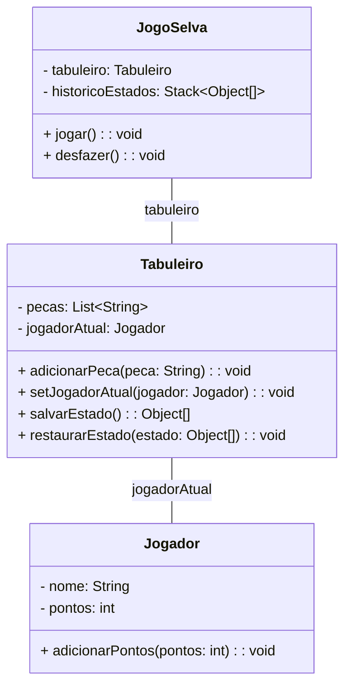

### Estrutura do padrão (GOF)


### Padrão aplicado no cenário
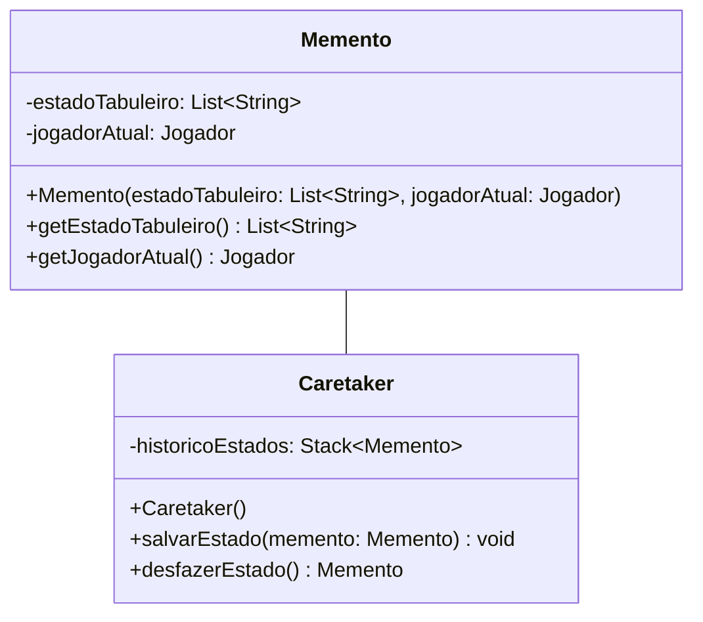
### Participantes
- **Originator(Tabuleiro):** A classe que cria o memento e restaura o seu estado a partir dele.
- **Memento (Memento):**  A classe que armazena o estado do objeto originador. Ela contém os dados necessários para restaurar o estado do jogo.
- **Caretaker (Caretaker):** A classe que gerencia os mementos e mantém o histórico dos estados.
  
### Descrição textual
O padrão de projeto Memento é utilizado para salvar e carregar o estado do jogo. No nosso framework, a classe Memento armazena o estado do tabuleiro em um momento específico. Esta classe contém duas informações principais: o estado atual do tabuleiro, representado por uma lista de peças (List<String>), e uma lista de objetos do tipo Jogador, que representam as peças ativas do jogo.

Ao usar o Memento, o jogo pode reverter para um estado anterior, oferecendo ao jogador a possibilidade de desfazer movimentos ou recuperar estados anteriores em caso de erro.

Por outro lado, a classe Caretaker atua como um guardião dos objetos Memento. Sua função principal é gerenciar os estados salvos, permitindo que o jogo salve e carregue seu estado de maneira eficiente. No contexto desse framework, o Caretaker armazena múltiplos estados do jogo em uma pilha (Stack<Memento>), permitindo que o jogador restaure o jogo ao último estado salvo ou a um estado anterior, se necessário.

A interação entre o Tabuleiro, Memento e Caretaker é essencial para a experiência do jogador. Quando um jogador precisar salvar o jogo, ele pode chamar o método salvarEstado, que cria um novo Memento contendo o estado atual do tabuleiro(peças e jogador ativo) e o armazena no Caretaker.

Se o jogador deseja reverter sua última jogada, ele pode usar o método restaurarEstado, que recupera o último Memento armazenado e restaura o estado do tabuleiro. Assim, o jogo consegue manter a continuidade da partida, permitindo que os jogadores experimentem diferentes estratégias e jogadas sem o medo de perder o progresso realizado.

### Código (Framework)
**Memento.java**

``` java
package framework.Memento;

import java.util.ArrayList;
import java.util.List;
import framework.model.Jogador;

public class Memento {
    private final List<String> estadoTabuleiro;
    private final Jogador jogadorAtual;

    public Memento(List<String> estadoTabuleiro, Jogador jogadorAtual) {
        this.estadoTabuleiro = new ArrayList<>(estadoTabuleiro);
        this.jogadorAtual = jogadorAtual;
    }

    public List<String> getEstadoTabuleiro() {
        return new ArrayList<>(estadoTabuleiro); // Retorna uma cópia para evitar alterações externas
    }

    public Jogador getJogadorAtual() {
        return jogadorAtual;
    }
}
```

**Caretaker.java**
``` java
package framework.Memento;

import java.util.Stack;

public class Caretaker {
    private final Stack<Memento> historicoEstados;

    public Caretaker() {
        this.historicoEstados = new Stack<>();
    }

    public void salvarEstado(Memento memento) {
        historicoEstados.push(memento);
    }

    public Memento desfazerEstado() {
        if (!historicoEstados.isEmpty()) {
            return historicoEstados.pop();
        }
        throw new IllegalStateException("Não há estados salvos para desfazer.");
    }
}
``` 

# Construindo um Novo Jogo

## Passo a Passo para utilização do Framework
### Passo 1 - Criar a Interface Central (Singleton)  
Crie uma classe DamasGame que implementa a interface Game.
Essa classe será responsável por gerenciar a configuração do jogo, como o tamanho do tabuleiro (largura e altura), quantidade máxima de jogadores e a quantidade máxima de peças
Aplique o padrão Singleton para garantir que haja apenas uma instância da configuração do jogo: Defina um construtor privado.
Implemente um método estático getInstance() para fornecer acesso global à instância única.
Inclua métodos como getQuantidadeMaximaDeJogadores(), getQuantidadeMaximaDePecas(), getAlturaTabuleiro(), e getLarguraTabuleiro().
     

### Passo 2 - Criar o Tabuleiro e Peças (Abstract Factory)  
Implemente o padrão Abstract Factory para criar o tabuleiro e as peças de Damas.
Crie uma classe DamasJogoFactory que implementa FabricaAbstrataJogo:
No método criarTabuleiro(), retorne uma instância de TabuleiroDamas, configurada com dimensões 8x8.
No método criarPeca(Jogador jogador, Posicao posicao, int forca, String tipo), crie instâncias de PecaDama com características específicas: Peças brancas nas três primeiras linhas. Peças pretas nas três últimas linhas.
Casas alternadas entre válidas e inválidas.
             
         
Use o Adapter TabuleiroAdapter para encapsular a lógica específica do tabuleiro de Damas, como validação de movimentos e limites.
     

### Passo 3 - Otimizar a Criação de Peças (Flyweight)  
Utilize o padrão Flyweight para otimizar o uso de memória ao criar peças.
Crie uma classe PecaFlyweightFactory que armazena instâncias reutilizáveis de peças com características compartilhadas (como cor e símbolo).
Reutilize essas instâncias sempre que possível para evitar duplicação de objetos.
Exemplo:
Uma única instância de "peça branca" é compartilhada entre todas as peças brancas.
Uma única instância de "peça preta" é compartilhada entre todas as peças pretas.

### Passo 4 - Definir o Comportamento das Peças (Strategy)  
Use o padrão Strategy para definir diferentes comportamentos de movimentação e captura:
Crie uma interface MovimentoStrategy com métodos como mover() e capturar().
Implemete classes concretas como:
MovimentoDamaNormal: Movimentação básica para frente.
MovimentoDamaPromovida: Movimentação em qualquer direção após promoção.
crie lógica para os outros comportamentos que diferem do básico, implementando a interface MovimentoStrategy, para que não de conflito no restante do codigo.

### Passo 5 - Gerenciar o Estado do Jogo (State)  
Implemente o padrão State para gerenciar os turnos dos jogadores:
Crie classes como TurnoJogadorBranco e TurnoJogadorPreto.
Alterne entre os estados conforme os jogadores realizam suas jogadas.
Cada estado deve encapsular a lógica específica para o jogador atual, como validar movimentos e verificar condições de vitória.
     

### Passo 6 - Salvar e Restaurar Estados (Memento)  
Use o padrão Memento para salvar e restaurar o estado do jogo:
Crie uma classe EstadoJogoMemento que armazena: A posição de todas as peça, o jogador atual.
Use um Caretaker para gerenciar o histórico de estados e permitir funcionalidades de desfazer/refazer.
Exemplo:
Quando um jogador realiza uma jogada, o estado atual é salvo no Caretaker.
Para desfazer, restaure o último estado salvo.
         
     
### Passo 7 - Simplificar a Interação com o Jogo (Facade)  
Crie uma classe DamasFacade que implementa RegrasJogoFacade: encapsule a lógica de validação de movimentos, capturas e controle de turnos.
Forneça métodos simples para o cliente interagir com o jogo:
movimentoValido(Peca peca, Posicao destino)
capturaValida(Peca atacante, Peca defensor)
verificarVencedor()
passarTurno()

### Passo 8 - Gerenciar Histórico de Jogadas (Command)  
Implemente o padrão Command para gerenciar o histórico de jogadas:
Crie uma classe MoverPecaDamaCommand que implementa Command.
Encapsule cada movimento como um objeto independente, permitindo funcionalidades como desfazer e refazer.
Use um GerenciadorComandos para armazenar o histórico de comandos.
     

# Referências
GAMMA, Erich. et al. Padrões de projetos: Soluções reutilizáveis de software orientados a objetos Bookman editora, 2009.
