# Padrão Builder

## Intenção
 Separar a construção de um objeto complexo da sua representação de modo que o
 mesmo processo de construção possa criar diferentes representações - `GOF`

### Motivação

#### Cenário sem a aplicação do padrão

Durante o desenvolvimento de jogos, a criação de objetos como por exemplo Jogador pode ser complexa quando envolve múltiplos atributos e validações. Sem a aplicação do padrão Builder, ao realizar o instanciamento de um jogador seria feita diretamente através de um construtor com múltiplos parâmetros:

```java
Jogador jogador = new Jogador("Carlos", "Azul", 100);
```

**Diagrama UML (cenário sem o padrão):**

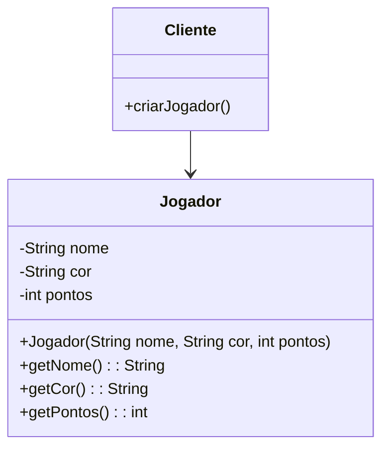

### Estrutura do padrão (GOF)


### Padrão aplicado no cenário

Aplicando o padrão Builder, a criação de Jogador é realizada passo a passo o que permiti a configuração de atributos obrigatórios e opcionais de uma forma clara e mais segura. O ConstrutorJogador implementa a interface BuilderJogador, fornecendo métodos para definir cada atributo. O DiretorJogador organiza a construção, garantindo que todas as etapas sejam seguidas de forma correta.

#### Classes envolvidas

- BuilderJogador    **-->** Interface 
- ConstrutorJogador **-->** Builder Concretos 
- DiretorJogador    **-->** Diretor
- Jogador           **-->** Objeto final

**Diagrama UML (cenário com o padrão):**

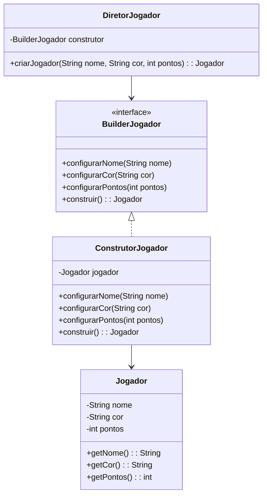

### Participantes

- Builder (BuilderJogador): Define a interface para construir diferentes partes do objeto Jogador

- ConcreteBuilder (ConstrutorJogador): Implementa a interface BuilderJogador que é responsável por construir o objeto Jogador

- Director (DiretorJogador): Controla o processo de construção, o que garante que os passos sejam seguidos corretamente

- Product (Jogador): O objeto complexo que está sendo construído

### Código (Framework)

**BuilderJogador**

```java
package builder;

import model.Jogador;

public interface BuilderJogador {
	void configurarNome(String nome);
	void configurarCor(String cor);
	void configurarPontos(int pontos);
	Jogador construir();
}
```

**DiretorJogador**

```java
package builder;

import model.Jogador;

public class DiretorJogador {

	private final ConstrutorJogador construtor;

	public DiretorJogador(ConstrutorJogador construtor) {
		this.construtor = construtor;
	}

	public Jogador criarJogador(String nome, String cor, int pontos) {
		construtor.configurarNome(nome);
		construtor.configurarCor(cor);
		construtor.configurarPontos(0);
		return construtor.construir();
	}
}
```


### Código (Jogo): 

COLOCAR
	

# Padrão Facade

## Intenção

Fornecer uma interface unificada para um conjunto de interfaces em um subsistema. O Facade define uma interface de nível mais alto que torna o subsistema mais fácil de usar. – `GoF`


## Motivação

### Cenário sem a aplicação do padrão

Sem o uso do padrão Facade, o código cliente precisa interagir diretamente com diversos componentes internos do jogo, como o controle de turnos, as regras de movimentação e captura. Isso gera um forte acoplamento e maior complexidade no código:

```java
if (peca.podeMover(destino) && regrasJogo.capturaValida(peca, inimigo)) {
    gerenciadorTurnos.proximoTurno();
}
```

Nesse cenário, o cliente precisa conhecer múltiplas classes e suas interações internas, o que torna a manutenção e a extensão do sistema mais difíceis.

**Diagrama UML (cenário sem o padrão):**

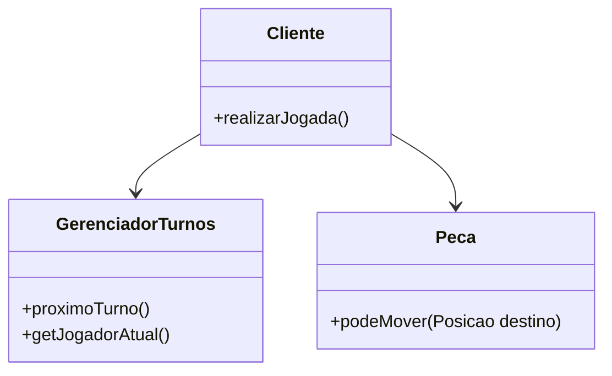


### Estrutura do padrão (GoF)
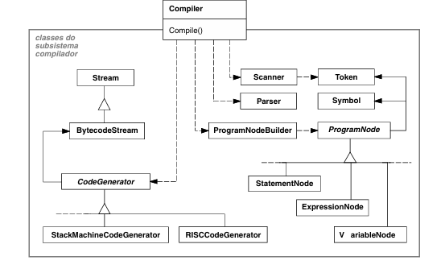


## Padrão aplicado no cenário

### Descrição textual

Ao aplicarmos o padrão Facade ao jogo Selva, criamos uma interface RegrasJogoFacade esta encapsula a lógica de movimentação, captura e controle de turnos. O cliente por sua vez ao invés de lidar com diversas classes diretamente, interage com essa fachada única.Reduzindo o acoplamento, melhorando a organização e facilitando modificações futuras.


### Classes envolvidas

- RegrasJogoFacade **-->** Interface
- RegrasJogoSelvaFacade **-->** Implementação concreta
- GerenciadorTurnos **-->** Subsistema interno de controle de turnos
- Peca, Posicao, Jogador **-->** Entidades do jogo que participam das regras

**Diagrama UML (cenário com o padrão):**

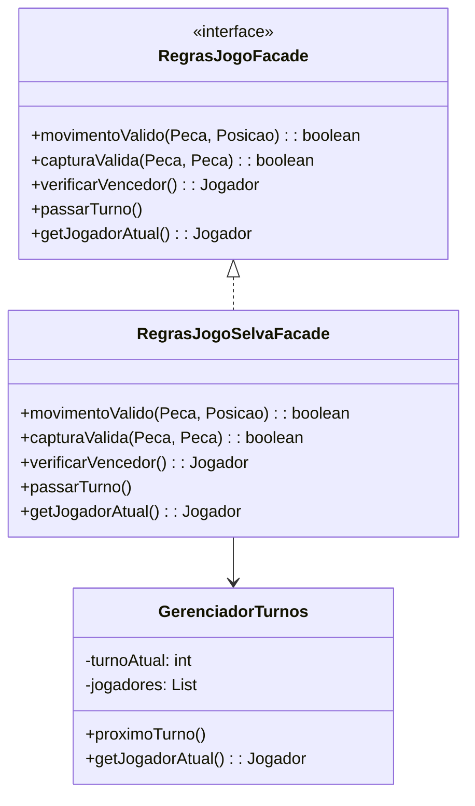


## Participantes

- Facade (RegrasJogoFacade): Interface unificada para operações de turno, movimento e regras do jogo.
- ConcreteFacade (RegrasJogoSelvaFacade): Implementação concreta da interface, orquestra as operações internas.
- Subsistemas (GerenciadorTurnos, Peca): Componentes internos encapsulados pela fachada.
- Cliente: Interage apenas com a fachada, sem conhecer os detalhes internos.


## Código

### Framework

**GerenciadorTurnos.java**

```java
package framework.facade;

import java.util.List;
import framework.model.Jogador;

public class GerenciadorTurnos {
    private int turnoAtual;
    private List<Jogador> jogadores;

    public GerenciadorTurnos(List<Jogador> jogadores) {
        if (jogadores == null || jogadores.isEmpty()) {
            throw new IllegalArgumentException("Lista de jogadores não pode ser vazia");
        }
        this.jogadores = jogadores; 
        this.turnoAtual = 0;
    }

    public void proximoTurno() {
        turnoAtual = (turnoAtual + 1) % jogadores.size();
    }

    public Jogador getJogadorAtual() {
        return jogadores.get(turnoAtual); 
    }
}
```

**RegrasJogoFacade.java**

```java
package framework.facade;

import framework.model.Jogador;
import framework.model.Posicao;
import framework.model.pecas.Peca;

public interface RegrasJogoFacade {
    boolean movimentoValido(Peca peca, Posicao destino);
    boolean capturaValida(Peca atacante, Peca defensor);
    Jogador verificarVencedor();
    void passarTurno();
    Jogador getJogadorAtual();
}
```

### Código (Jogo): 

COLOCAR
    


# Padrão Factory Method

## Intenção  
Definir uma interface para criar um objeto, mas deixar as subclasses decidirem qual classe instanciar. O Factory Method permite adiar a instanciação para as subclasses. – `GOF`

## Motivação

### Cenário sem a aplicação do padrão

Ao criar diferentes peças em um jogo, como leões, tigres ou ratos, o código pode ficar fortemente acoplado às classes concretas dessas peças:

```java
Peca peca = new Leao(new Posicao(0, 0), jogador);
```

O que acaba dificultando a manutenção e a expansão, tornando mais difícil mudar o comportamento da criação de peças no futuro, além de quebrar o princípio aberto-fechado.

**Diagrama UML (cenário sem o padrão):**

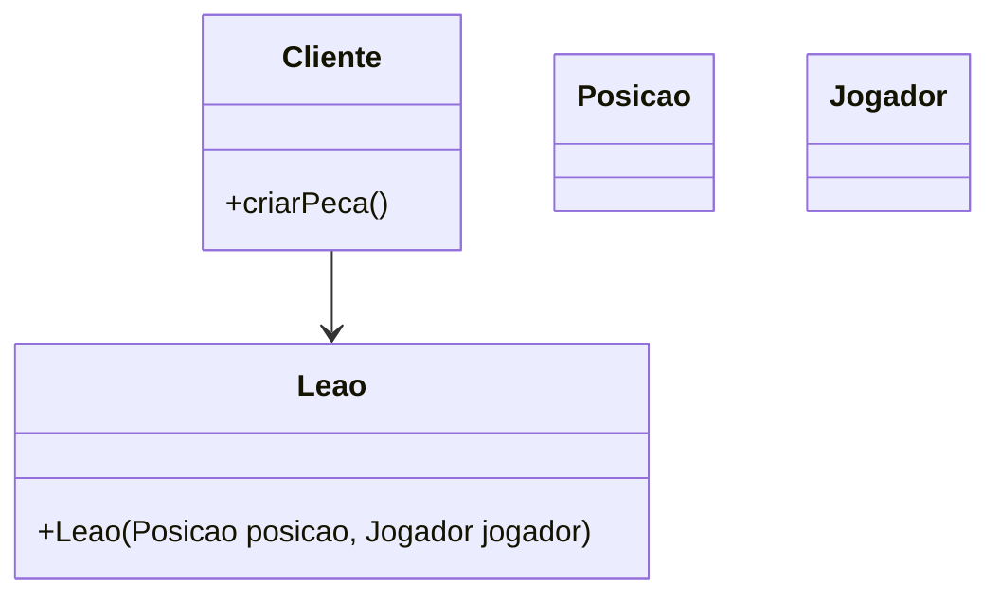

---

## Estrutura do padrão (GOF)


---

## Padrão aplicado no cenário

### Descrição textual

Aplicando o padrão Factory Method no framework, criamos a interface CriadorPeca, que define o contrato para a criação de peças. A interface estendida FactoryMethodCriadorPeca adiciona suporte para criação de peças com base em um tipo específico TipoAnimal. Isso permite que as subclasses implementem a lógica específica para instanciar peças de forma flexível, encapsulando o processo de criação.


### Classes envolvidas

- CriadorPeca → Interface 
- FactoryMethodCriadorPeca → Interface especializada do método fábrica
- Peca → Produto
- Posicao, Jogador, TipoAnimal → Parâmetros utilizados na criação da peça

**Diagrama UML (cenário com o padrão):**

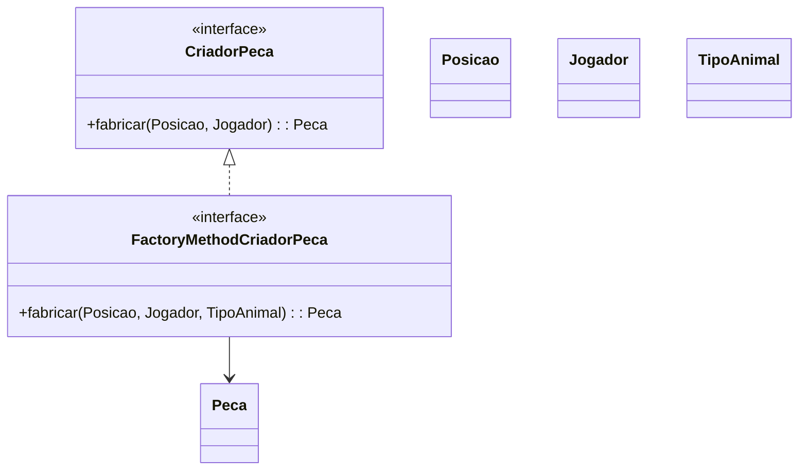

## Participantes

- Creator (CriadorPeca): Declara o método de fábrica que retorna objetos do tipo Peca.
- ConcreteCreator (FactoryMethodCriadorPeca): Especializa a criação do produto com base em TipoAnimal, permitindo maior flexibilidade.
- Product (Peca): Define a interface comum para os objetos que serão criados.
- Client: Usa o método fábrica sem depender de implementações concretas das peças.

---

### Código (Framework)

**CriadorPeca.java**

```java
package framework.factoryMethod;

import framework.model.Jogador;
import framework.model.Posicao;
import framework.model.pecas.Peca;

public interface CriadorPeca {
    Peca fabricar(Posicao posicao, Jogador jogador);
}
```

**FactoryMethodCriadorPeca.java**

```java
package framework.factoryMethod;

import framework.model.Jogador;
import framework.model.Posicao;
import framework.model.pecas.Peca;
import framework.model.pecas.TipoAnimal;

public interface FactoryMethodCriadorPeca extends CriadorPeca {
    Peca fabricar(Posicao posicao, Jogador jogador, TipoAnimal animal);
}
```

---

### Código (Jogo):

COLOCAR


# Padrão Prototype

## Intenção  
Especificar os tipos de objetos a serem criados usando uma instância prototípica e criar novos objetos copiando esse protótipo. – `GOF`


## Motivação

### Cenário sem a aplicação do padrão

A criação de peças exige configurações e estados complexos. Sem o uso do padrão Prototype, cada nova peça precisa ser criada do zero com todas as configurações, o que pode tornar o processo custoso em termos de desempenho e legibilidade:

```java
Peca tigre = new Tigre(new Posicao(2, 2), jogador);
```

 O que torna a duplicação de objetos semelhante mais difícil, especialmente quando eles compartilham a mesma configuração básica.

**Diagrama UML (cenário sem o padrão):**

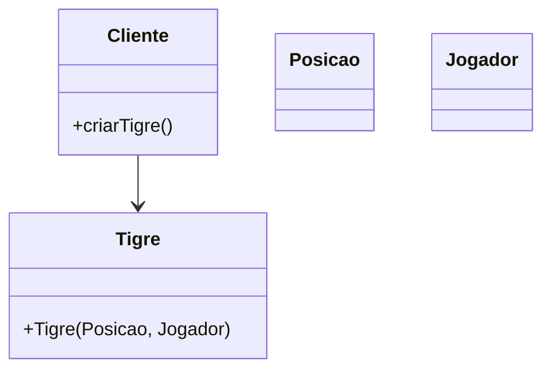


## Estrutura do padrão (GOF)


## Padrão aplicado no cenário

### Descrição textual

Com o padrão Prototype, definimos a interface PecaPrototype, que oferece um método clonar(). Cada peça concreta poderá ser clonada a partir de um protótipo existente, permitindo criar novos objetos com base em um modelo já configurado. Isso reduz o custo de criação e facilita a replicação de peças semelhantes com pequenas variações.

### Classes envolvidas

- PecaPrototype **-->**  Interface
- Posicao, Jogador **-->**  Parâmetros de estado
- Peças concretas **-->**  Protótipos clonáveis
- clonar() **-->**  Método principal para duplicar

**Diagrama UML (cenário com o padrão):**

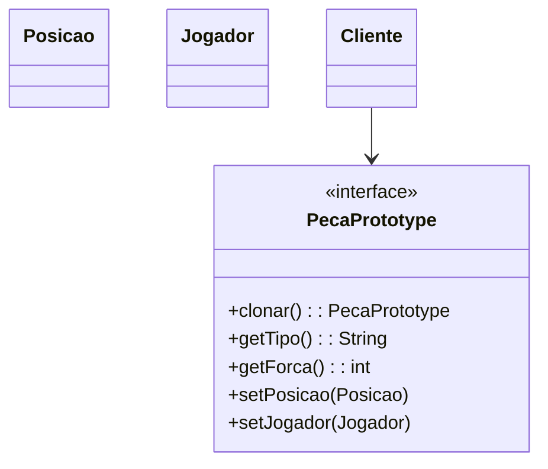

## Participantes

- Prototype (PecaPrototype): Interface para clonagem de si mesmo.
- ConcretePrototype (ex: Tigre, Rato): Implementa a clonagem de si mesmo, retornando uma nova instância com o mesmo estado.
- Client: Usa o protótipo para clonar novos objetos sem depender diretamente de suas classes concretas.


### Código (Framework)

**PecaPrototype.java**

```java
package framework.prototype;

import framework.model.Jogador;
import framework.model.Posicao;

public interface PecaPrototype extends Cloneable {
    PecaPrototype clonar();  
    String getTipo();      
    int getForca();
    void setPosicao(Posicao posicao);
    void setJogador(Jogador jogador);
}
```

### Código (Jogo):

COLOCAR


# Padrão Memento

## Intenção 
Sem violar o encapsulamento, salvar e carregar um estado interno de um objeto, de maneira que o objeto possa ser restaurado para esse estado mais tarde.

## Motivação
No jogo, salvar e restaurar o estado do tabuleiro (como as peças e o jogador atual) exigiria expor detalhes internos do Tabuleiro para outras classes, violando o encapsulamento. Além disso, gerenciar múltiplos estados salvos de forma manual seria confuso, propenso a erros e dificultaria implementar funcionalidades como "desfazer" ou "refazer". O padrão Memento resolve esses problemas ao permitir que o Tabuleiro crie um objeto Memento para armazenar seu estado interno de forma segura e protegida. O Caretaker assume a responsabilidade de gerenciar os estados salvos, organizando-os em uma pilha. Dessa forma, o Tabuleiro mantém total controle sobre seu estado, enquanto o Caretaker simplifica o gerenciamento de múltiplos estados.

### Cenário sem a aplicação do padrão
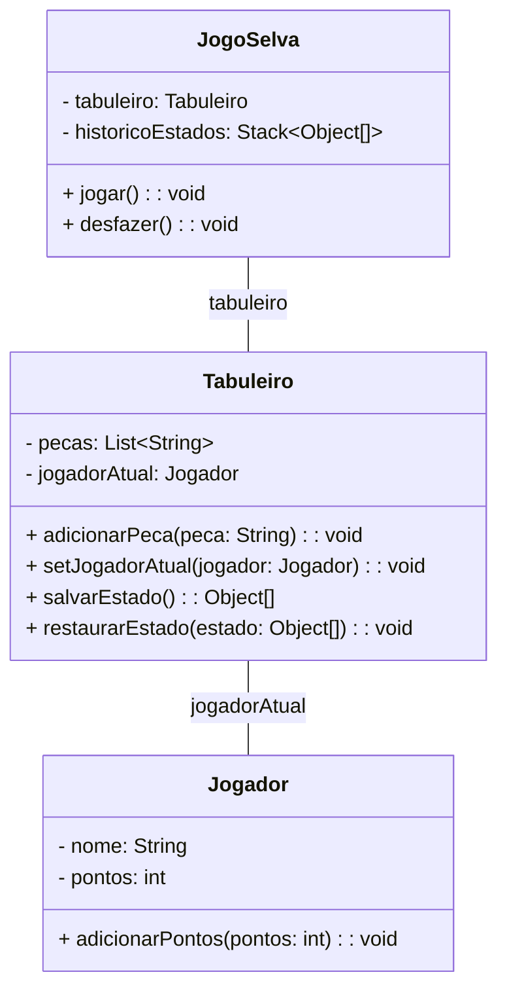

## Estrutura do padrão (GOF)


## Padrão aplicado no cenário
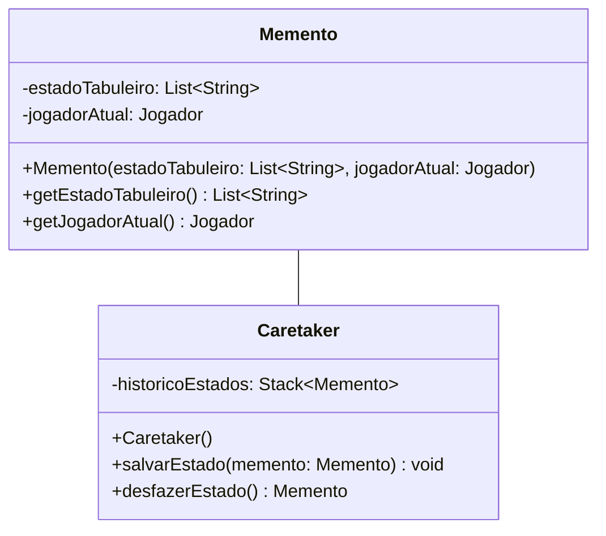
## Participantes
- Originator(Tabuleiro): A classe que cria o memento e restaura o seu estado a partir dele.
- Memento (Memento):  A classe que armazena o estado do objeto originador. Ela contém os dados necessários para restaurar o estado do jogo.
- Caretaker (Caretaker): A classe que gerencia os mementos e mantém o histórico dos estados.
  
### Descrição textual
     
### Código (Framework)
**Memento.java**

``` java
package framework.Memento;

import java.util.ArrayList;
import java.util.List;
import framework.model.Jogador;

public class Memento {
    private final List<String> estadoTabuleiro;
    private final Jogador jogadorAtual;

    public Memento(List<String> estadoTabuleiro, Jogador jogadorAtual) {
        this.estadoTabuleiro = new ArrayList<>(estadoTabuleiro);
        this.jogadorAtual = jogadorAtual;
    }

    public List<String> getEstadoTabuleiro() {
        return new ArrayList<>(estadoTabuleiro); // Retorna uma cópia para evitar alterações externas
    }

    public Jogador getJogadorAtual() {
        return jogadorAtual;
    }
}
```

**Caretaker.java**
``` java
package framework.Memento;

import java.util.Stack;

public class Caretaker {
    private final Stack<Memento> historicoEstados;

    public Caretaker() {
        this.historicoEstados = new Stack<>();
    }

    public void salvarEstado(Memento memento) {
        historicoEstados.push(memento);
    }

    public Memento desfazerEstado() {
        if (!historicoEstados.isEmpty()) {
            return historicoEstados.pop();
        }
        throw new IllegalStateException("Não há estados salvos para desfazer.");
    }
}
```

# Padrão Command

## Intenção
Controlar as chamadas a um determinado componente, no contexto desse framework, a movimentação (método makeMove), modelando cada requisição como um objeto. Permitir que as operações possam ser desfeitas, enfileiradas ou registradas.

## Motivação
Ao desenvolver um framework para jogos de tabuleiro, como o jogo Selva, surgiu a necessidade de permitir que os jogadores desfaçam ou refaçam suas jogadas. Sem o padrão Command, a implementação dessas funcionalidades seria problemática: a lógica de desfazer e refazer ficaria diretamente acoplada à classe Jogador, dificultando a adição de novas ações. Além disso, gerenciar manualmente o histórico de todas as ações comprometeria a modularidade do sistema, impedindo sua reutilização em outros jogos ou contextos. O padrão Command  resolve esses problemas ao encapsular cada ação, como mover uma peça, em objetos independentes. Isso permite gerenciar o histórico de forma simples e organizada, facilitando a implementação de desfazer e refazer.

### Cenário sem a aplicação do padrão
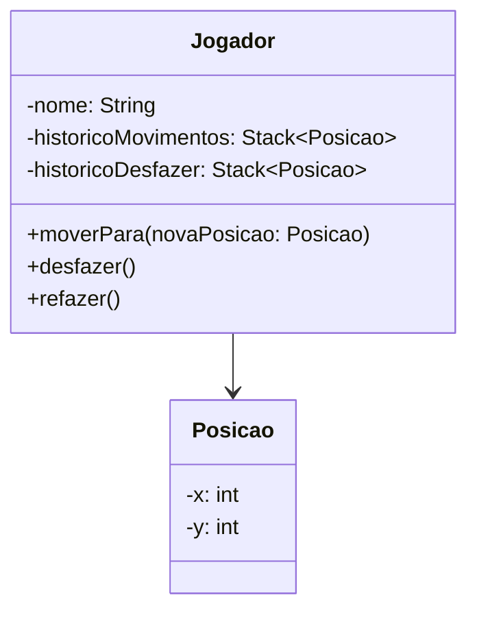
## Estrutura do padrão (GOF)


## Padrão aplicado no cenário
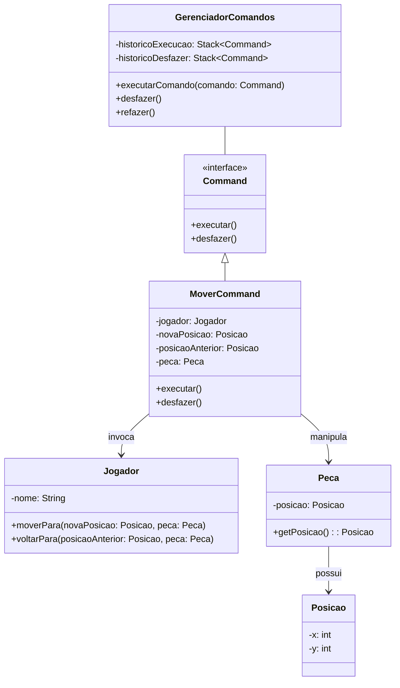
## Participantes
- Command (Command): Define a interface comum para todos os comandos, com os métodos executar e desfazer.
- ConcreteCommand (MoverComando): Implementa os comandos executar e desfazer, referenciando o tabuleiro. O método executar() chama a ação mover no tabuleiro.
- Receiver (Jogador e Peca): Realiza as operações reais que o comando abstrai.
- Invoker (Gerenciador de Comandos): Armazena e executa os comandos. Ele chama o executar() no comando e mantém uma lista para desfazer as ações.
