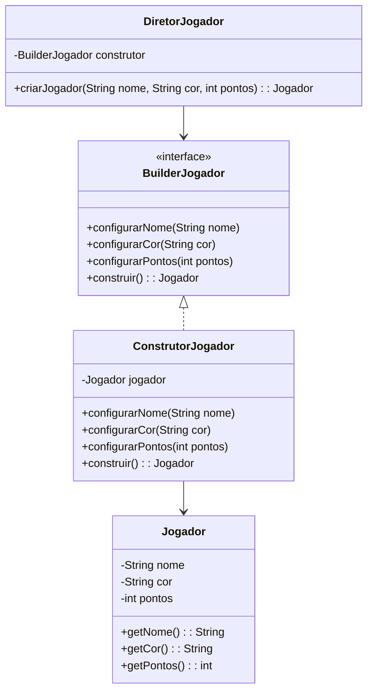
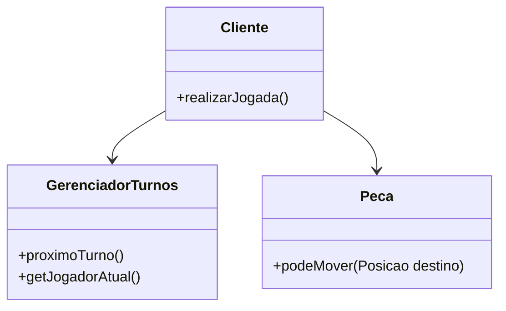
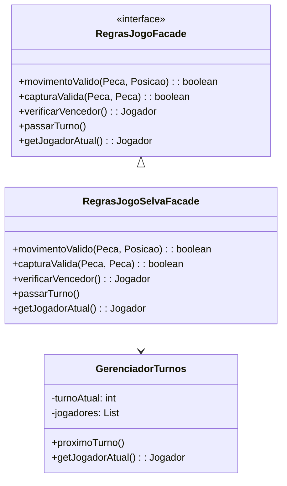
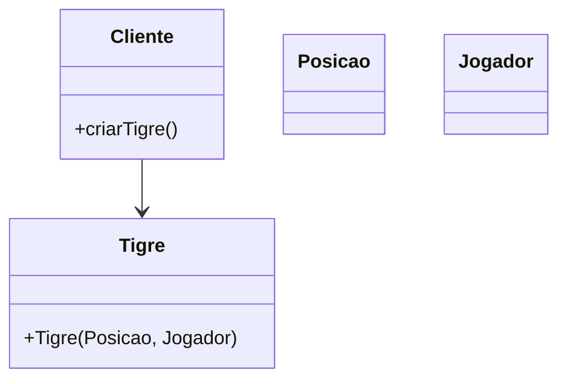
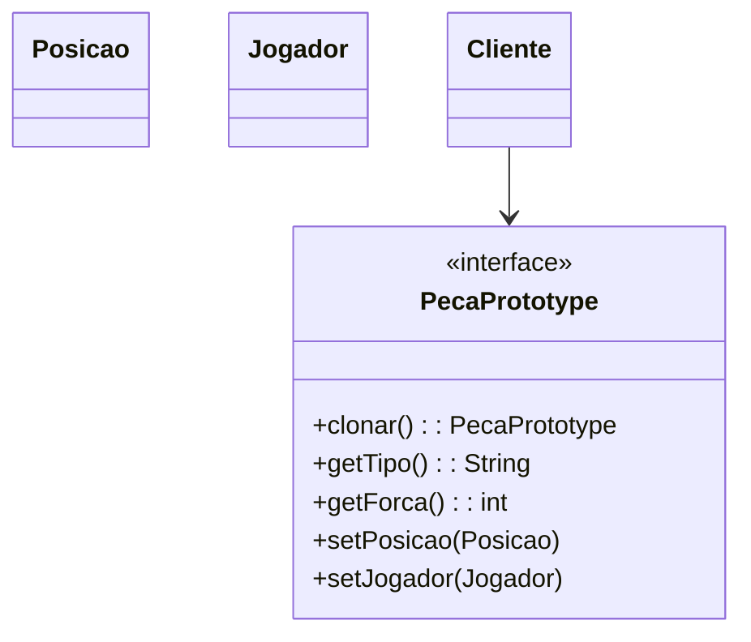
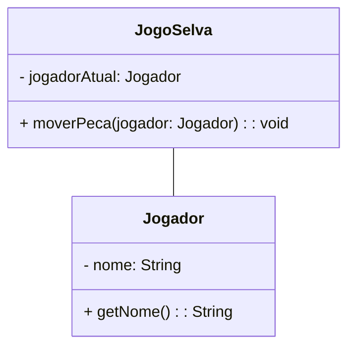
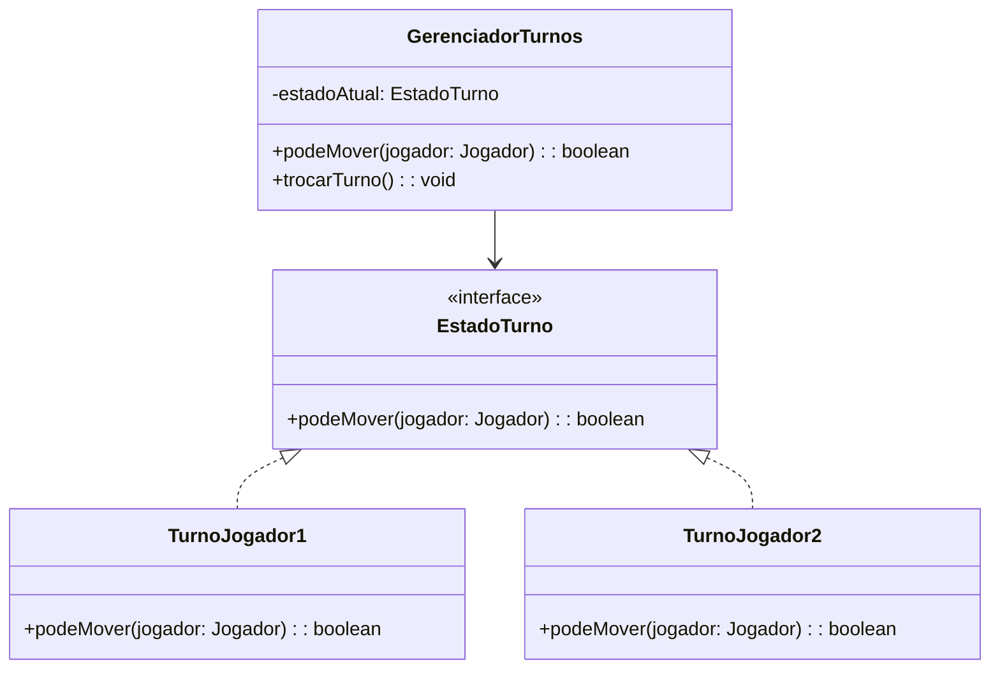
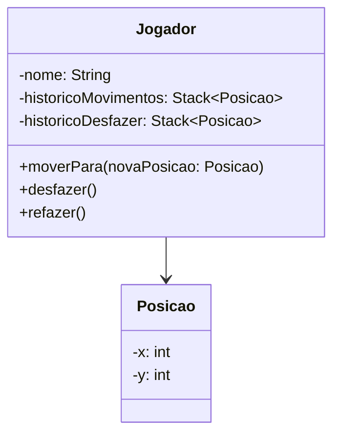
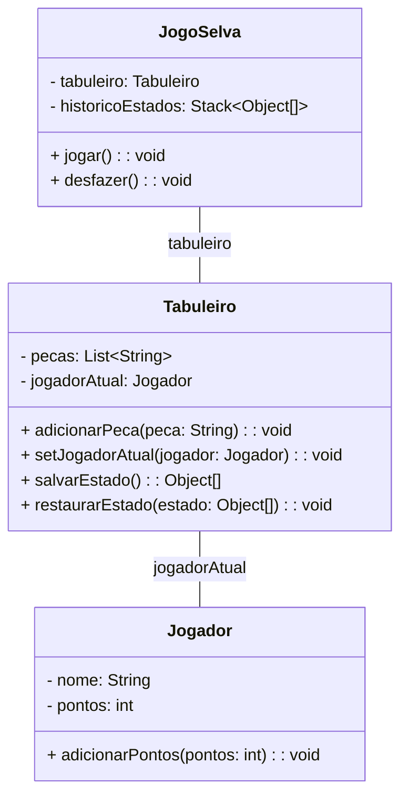
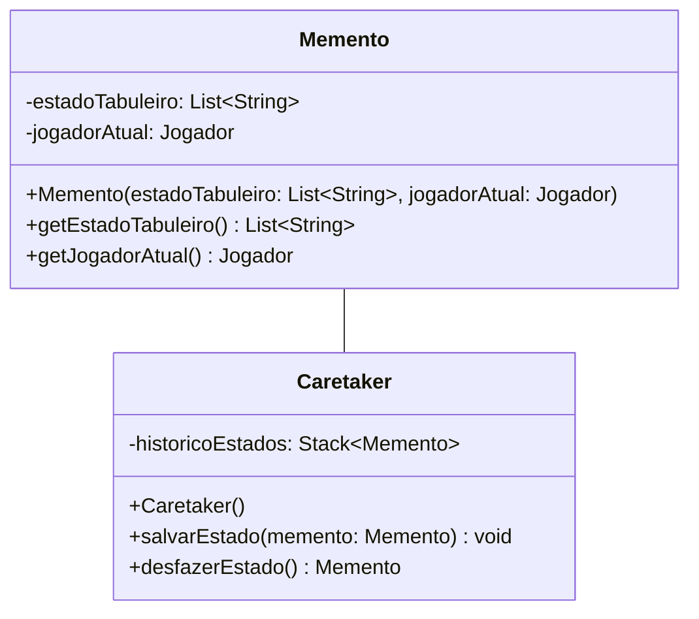

 

# Padrão Builder

## Intenção
 Separar a construção de um objeto complexo da sua representação de modo que o
 mesmo processo de construção possa criar diferentes representações - `GOF`

### Motivação

#### Cenário sem a aplicação do padrão

Durante o desenvolvimento de jogos, a criação de objetos como por exemplo Jogador pode ser complexa quando envolve múltiplos atributos e validações. Sem a aplicação do padrão Builder, ao realizar o instanciamento de um jogador seria feita diretamente através de um construtor com múltiplos parâmetros:

```java
Jogador jogador = new Jogador("Carlos", "Azul", 100);
```

**Diagrama UML (cenário sem o padrão):**

```mermaid
   
```

### Estrutura do padrão (GOF)


### Padrão aplicado no cenário

Aplicando o padrão Builder, a criação de Jogador é realizada passo a passo o que permiti a configuração de atributos obrigatórios e opcionais de uma forma clara e mais segura. O ConstrutorJogador implementa a interface BuilderJogador, fornecendo métodos para definir cada atributo. O DiretorJogador organiza a construção, garantindo que todas as etapas sejam seguidas de forma correta.

#### Classes envolvidas

- BuilderJogador    **-->** Interface 
- ConstrutorJogador **-->** Builder Concretos 
- DiretorJogador    **-->** Diretor
- Jogador           **-->** Objeto final

**Diagrama UML (cenário com o padrão):**



### Participantes

- Builder (BuilderJogador): Define a interface que define os métodos necessários para construir um Jogador.

- ConcreteBuilder (ConstrutorJogador): Implementa a interface BuilderJogador que é responsável por construir o Jogador.

- Director (DiretorJogador): Controla o processo de construção, o que garante que os passos sejam seguidos corretamente.

- Product (Jogador): O objeto complexo que está sendo construído.

### Código (Framework)

**BuilderJogador**

```java
package builder;

import model.Jogador;

public interface BuilderJogador {
	void configurarNome(String nome);
	void configurarCor(String cor);
	void configurarPontos(int pontos);
	Jogador construir();
}
```

**DiretorJogador**

```java
package builder;

import model.Jogador;

public class DiretorJogador {

	private final ConstrutorJogador construtor;

	public DiretorJogador(ConstrutorJogador construtor) {
		this.construtor = construtor;
	}

	public Jogador criarJogador(String nome, String cor, int pontos) {
		construtor.configurarNome(nome);
		construtor.configurarCor(cor);
		construtor.configurarPontos(0);
		return construtor.construir();
	}
}
```


### Código (Jogo): 

COLOCAR


# Padrão Factory Method

## Intenção  
Definir uma interface para a criação de peças, permitindo que as subclasses decidam qual peça instanciar. Dessa maneira, a criação das peças ganha flexibilidade.

## Motivação

### Cenário sem a aplicação do padrão

Ao criar diferentes peças em um jogo, como leões, tigres ou ratos, o código pode ficar fortemente acoplado às classes concretas dessas peças:

O que acaba dificultando a manutenção e a expansão, tornando mais difícil mudar o comportamento da criação de peças no futuro, além de quebrar o princípio aberto-fechado.

**Diagrama UML (cenário sem o padrão):**

```mermaid
classDiagram
    class Peca {
        <<abstract>>
        -tipo: String
        -forca: int
        -jogador: Jogador
        -posicao: Posicao
    }

    class TipoAnimal {
        <<enumeration>>
        GATO
        CACHORRO
        ELEFANTE
        LEOPARDO
        LEAO
        RATO
        TIGRE
        LOBO
    }

    class Jogo {
        -pecas: List~Peca~
        +criarPeca(TipoAnimal, Posicao, Jogador): Peca
    }

    Peca --> TipoAnimal
    Jogo --> Peca

---

## Estrutura do padrão (GOF)


---

### Classes envolvidas

- CriadorPeca → Interface 
- FactoryMethodCriadorPeca → Interface especializada do método fábrica
- Peca → Produto
- Posicao, Jogador, TipoAnimal → Parâmetros utilizados na criação da peça

**Diagrama UML (cenário com o padrão):**

```mermaid
classDiagram
    class CriadorPeca {
        <<interface>>
        +fabricar(Posicao, Jogador): Peca
    }

    class FactoryMethodCriadorPeca {
        <<interface>>
        +fabricar(Posicao, Jogador, TipoAnimal): Peca
    }

    class CriadorPecaSelvaConcreto {
        +fabricar(Posicao, Jogador): Peca
        +fabricar(Posicao, Jogador, TipoAnimal): Peca
    }

    class Peca {
        <<abstract>>
        -tipo: String
        -forca: int
        -jogador: Jogador
        -posicao: Posicao
        +getTipo(): String
        +getForca(): int
        +getJogador(): Jogador
        +setJogador(Jogador): void
        +getPosicao(): Posicao
        +setPosicao(Posicao): void
    }

    class TipoAnimal {
        <<enumeration>>
        GATO
        CACHORRO
        ELEFANTE
        LEOPARDO
        LEAO
        RATO
        TIGRE
        LOBO
        +getForca(): int
        +getSimbolo(): String
    }

    CriadorPeca <|-- FactoryMethodCriadorPeca
    FactoryMethodCriadorPeca <|-- CriadorPecaSelvaConcreto
    CriadorPecaSelvaConcreto ..> Peca
    Peca --> TipoAnimal
  
	
```

## Participantes

- Creator (CriadorPeca): Classe abstrata que define o método factory, deixando para a fábrica a responsabilidade de instanciá-la corretamente.
- ConcreteCreator (CriadorPecaSelvaConcreto): Implementação concreta de CriadorPeca, especializada na criação de peças do jogo.
- Product (Peca): Define o contrato básico para todas as peças do jogo. Ela garante que todas as peças possam ser tratadas de maneira uniforme, permitindo que o código que manipula as peças seja flexível e extensível.
- Client: Usa o método fábrica sem depender de implementações concretas das peças.
  
## Descrição textual

A interface CriadorPeca é a base para a criação de peças no jogo. Ela define um contrato que todas as classes criadoras de peças devem seguir, garantindo que cada peça seja criada com uma posição (Posicao) e um jogador (Jogador) associados. Essa abstração permite que o processo de criação de peças seja padronizado e desacoplado do restante do código. 

A interface FactoryMethodCriadorPeca estende CriadorPeca e adiciona um novo método fabricar, que inclui um parâmetro adicional: o tipo de animal (TipoAnimal). Essa extensão permite que as peças sejam criadas com características específicas, como força e comportamento, associadas ao tipo de animal correspondente. 

A classe CriadorPecaSelvaConcreto é uma implementação concreta da interface FactoryMethodCriadorPeca. Ela é responsável por criar peças específicas para o jogo Selva. O método fabricar(Posicao posicao, Jogador jogador) lança uma exceção caso seja chamado, pois exige que o tipo de animal seja especificado. Já o método fabricar(Posicao posicao, Jogador jogador, TipoAnimal tipoAnimal) cria uma instância da classe Animal, que representa uma peça do jogo com atributos como nome, força, jogador e posição. 
 
Se novas peças precisarem ser introduzidas no jogo, basta adicionar essas peças à fábrica, mantendo o restante do código desacoplado e organizado.


---

### Código (Framework)

**CriadorPeca.java**

```java
package framework.factoryMethod;

import framework.model.Jogador;
import framework.model.Posicao;
import framework.model.pecas.Peca;

public interface CriadorPeca {
    Peca fabricar(Posicao posicao, Jogador jogador);
}
```

**FactoryMethodCriadorPeca.java**

```java
package framework.factoryMethod;

import framework.model.Jogador;
import framework.model.Posicao;
import framework.model.pecas.Peca;
import framework.model.pecas.TipoAnimal;

public interface FactoryMethodCriadorPeca extends CriadorPeca {
    Peca fabricar(Posicao posicao, Jogador jogador, TipoAnimal animal);
}
```
**CriadorPecaSelvaConcreto.java**
```java
package jogo.factorymethod;

import framework.factoryMethod.FactoryMethodCriadorPeca;
import framework.model.Jogador;
import framework.model.Posicao;
import framework.model.pecas.Peca;
import framework.model.pecas.TipoAnimal;
import jogo.model.Animal;

public class CriadorPecaSelvaConcreto implements FactoryMethodCriadorPeca {

    @Override
    public Peca fabricar(Posicao posicao, Jogador jogador) {
        throw new UnsupportedOperationException("Método 'fabrica' não implementado: Parâmetros incorretos, é necessário definir o tipo do animal.");
    }

    @Override
    public Peca fabricar(Posicao posicao, Jogador jogador, TipoAnimal tipoAnimal) {
        return new Animal(tipoAnimal.toString(), tipoAnimal.getForca(), jogador, posicao);
    }
}
```
---

### Código (Jogo):

COLOCAR

# Padrão Abstract Factory

## Intenção
Construir famílias de peças para cada jogador sem especificar suas classes concretas.

## Motivação


### Cenário sem a aplicação do padrão

### Estrutura do padrão (GoF)


## Padrão aplicado no cenário

### Descrição textual


## Participantes
- AbstractFactory (FabricaAbstratataJogo): Define uma interface para criar uma família de peças e um tabuleiro.
- ConcreteFactory ():
- AbstractProduct ():
- ConcreteProduct ():


# Padrão Facade

## Intenção

Fornecer uma interface unificada para um conjunto de interfaces em um subsistema. O Facade define uma interface de nível mais alto que torna o subsistema mais fácil de usar. – `GoF`


## Motivação

### Cenário sem a aplicação do padrão

Sem o uso do padrão Facade, o código cliente precisa interagir diretamente com diversos componentes internos do jogo, como o controle de turnos, as regras de movimentação e captura. Isso gera um forte acoplamento e maior complexidade no código:

```java
if (peca.podeMover(destino) && regrasJogo.capturaValida(peca, inimigo)) {
    gerenciadorTurnos.proximoTurno();
}
```

Nesse cenário, o cliente precisa conhecer múltiplas classes e suas interações internas, o que torna a manutenção e a extensão do sistema mais difíceis.

**Diagrama UML (cenário sem o padrão):**




### Estrutura do padrão (GoF)


## Padrão aplicado no cenário

### Descrição textual

Ao aplicarmos o padrão Facade ao jogo Selva, criamos uma interface RegrasJogoFacade esta encapsula a lógica de movimentação, captura e controle de turnos. O cliente por sua vez ao invés de lidar com diversas classes diretamente, interage com essa fachada única.Reduzindo o acoplamento, melhorando a organização e facilitando modificações futuras.


### Classes envolvidas

- RegrasJogoFacade **-->** Interface
- RegrasJogoSelvaFacade **-->** Implementação concreta
- GerenciadorTurnos **-->** Subsistema interno de controle de turnos
- Peca, Posicao, Jogador **-->** Entidades do jogo que participam das regras

**Diagrama UML (cenário com o padrão):**




## Participantes

- Facade (RegrasJogoFacade): Interface unificada para operações de turno, movimento e regras do jogo.
- ConcreteFacade (RegrasJogoSelvaFacade): Implementação concreta da interface, orquestra as operações internas.
- Subsistemas (GerenciadorTurnos, Peca): Componentes internos encapsulados pela fachada.
- Cliente: Interage apenas com a fachada, sem conhecer os detalhes internos.


## Código

### Framework

**GerenciadorTurnos.java**

```java
package framework.facade;

import java.util.List;
import framework.model.Jogador;

public class GerenciadorTurnos {
    private int turnoAtual;
    private List<Jogador> jogadores;

    public GerenciadorTurnos(List<Jogador> jogadores) {
        if (jogadores == null || jogadores.isEmpty()) {
            throw new IllegalArgumentException("Lista de jogadores não pode ser vazia");
        }
        this.jogadores = jogadores; 
        this.turnoAtual = 0;
    }

    public void proximoTurno() {
        turnoAtual = (turnoAtual + 1) % jogadores.size();
    }

    public Jogador getJogadorAtual() {
        return jogadores.get(turnoAtual); 
    }
}
```

**RegrasJogoFacade.java**

```java
package framework.facade;

import framework.model.Jogador;
import framework.model.Posicao;
import framework.model.pecas.Peca;

public interface RegrasJogoFacade {
    boolean movimentoValido(Peca peca, Posicao destino);
    boolean capturaValida(Peca atacante, Peca defensor);
    Jogador verificarVencedor();
    void passarTurno();
    Jogador getJogadorAtual();
}
```

### Código (Jogo): 

COLOCAR
    

# Padrão Prototype

## Intenção  
Especificar os tipos de objetos a serem criados usando uma instância prototípica e criar novos objetos copiando esse protótipo. – `GOF`


## Motivação

### Cenário sem a aplicação do padrão

A criação de peças exige configurações e estados complexos. Sem o uso do padrão Prototype, cada nova peça precisa ser criada do zero com todas as configurações, o que pode tornar o processo custoso em termos de desempenho e legibilidade:

```java
Peca tigre = new Tigre(new Posicao(2, 2), jogador);
```

 O que torna a duplicação de objetos semelhante mais difícil, especialmente quando eles compartilham a mesma configuração básica.

**Diagrama UML (cenário sem o padrão):**




## Estrutura do padrão (GOF)


## Padrão aplicado no cenário

### Descrição textual

Com o padrão Prototype, definimos a interface PecaPrototype, que oferece um método clonar(). Cada peça concreta poderá ser clonada a partir de um protótipo existente, permitindo criar novos objetos com base em um modelo já configurado. Isso reduz o custo de criação e facilita a replicação de peças semelhantes com pequenas variações.

### Classes envolvidas

- PecaPrototype **-->**  Interface
- Posicao, Jogador **-->**  Parâmetros de estado
- Peças concretas **-->**  Protótipos clonáveis
- clonar() **-->**  Método principal para duplicar

**Diagrama UML (cenário com o padrão):**



## Participantes

- Prototype (PecaPrototype): Interface para clonagem de si mesmo.
- ConcretePrototype (ex: Tigre, Rato): Implementa a clonagem de si mesmo, retornando uma nova instância com o mesmo estado.
- Client: Usa o protótipo para clonar novos objetos sem depender diretamente de suas classes concretas.


### Código (Framework)

**PecaPrototype.java**

```java
package framework.prototype;

import framework.model.Jogador;
import framework.model.Posicao;

public interface PecaPrototype extends Cloneable {
    PecaPrototype clonar();  
    String getTipo();      
    int getForca();
    void setPosicao(Posicao posicao);
    void setJogador(Jogador jogador);
}
```

### Código (Jogo):

COLOCAR


# Padrão State

## Intenção
Permite a um objeto alterar seu comportamento quando o seu estado interno muda. No contexto desse framework, o comportamento da movimentação de peças será alterado para só permitir que a peça do jogador atual seja movida.

## Motivação
Em jogos de turno, é necessário controlar qual jogador pode executar ações em determinado momento. Usar estruturas condicionais (if, switch) espalhadas pelo código para verificar o jogador atual torna o sistema rígido e difícil de manter. Com o padrão State, encapsulamos os comportamentos de cada estado em classes específicas, permitindo que o jogo altere dinamicamente seu comportamento ao mudar o estado atual.

### Cenário sem a aplicação do padrão


## Estrutura do padrão (GOF)


## Padrão aplicado no cenário


## Participantes
- **Context (GerenciadorTurnos):** Armazena a referência para o estado atual e delega a ele o comportamento.
- **State (EstadoTurno):** Define uma interface para encapsulamento comum para todos os estados.
- **ConcreteStates (TurnoJogador1, TurnoJogador2):** Implementa o comportamento específico para cada um dos jogadores, garantindo que cada jogador consiga mover apenas as suas peças.

### Descrição textual
O GerenciadorTurnos mantém um estadoAtual, que define qual jogador está ativo.
Quando um jogador tenta mover uma peça, o método podeMover(jogador) do estado atual decide se ele pode ou não jogar.
Ao fim de uma jogada válida, o método trocarTurno() altera o estado atual para o outro jogador.

### Código (Framework)

**EstadoTurno.java**
```java
public interface EstadoTurno {
    boolean podeMover(Jogador jogador);
}
```

**TurnoJogador1.java**
```java
public class TurnoJogador1 implements EstadoTurno {
    @Override
    public boolean podeMover(Jogador jogador) {
        return jogador.getId() == 1;
    }
}
```

**TurnoJogador2.java**
```java
public class TurnoJogador2 implements EstadoTurno {
    @Override
    public boolean podeMover(Jogador jogador) {
        return jogador.getId() == 2;
    }
}
```

**GerenciadorTurnos.java**
```java
public class GerenciadorTurnos {
    private EstadoTurno estadoAtual;

    public GerenciadorTurnos() {
        this.estadoAtual = new TurnoJogador1();
    }

    public boolean podeMover(Jogador jogador) {
        return estadoAtual.podeMover(jogador);
    }

    public void trocarTurno() {
        if (estadoAtual instanceof TurnoJogador1) {
            estadoAtual = new TurnoJogador2();
        } else {
            estadoAtual = new TurnoJogador1();
        }
    }
}
```

# Padrão Command
## Intenção
Controlar as chamadas a um determinado componente, no contexto desse framework, a movimentação, modelando cada requisição como um objeto. Permitir que as operações possam ser desfeitas, enfileiradas ou registradas.

## Motivação
Ao desenvolver um framework para jogos de tabuleiro, como o jogo Selva, surgiu a necessidade de permitir que os jogadores desfaçam ou refaçam suas jogadas. Sem o padrão Command, a implementação dessas funcionalidades seria problemática, pois a lógica de desfazer e refazer ficaria diretamente acoplada à classe Jogador, dificultando a adição de novas ações e tornando o código confuso e propenso a erros. Além disso, gerenciar manualmente o histórico de todas as ações comprometeria a modularidade do sistema, impedindo sua reutilização em outros jogos ou contextos. O padrão Command  resolve esses problemas ao encapsular cada ação, como mover uma peça, em objetos independentes. Isso permite gerenciar o histórico de forma simples e organizada, facilitando a implementação de desfazer e refazer, além de tornar o sistema mais extensível e reutilizável.

### Cenário sem a aplicação do padrão


## Estrutura do padrão (GOF)

## Padrão aplicado no cenário

## Participantes
- Command (Command): Define a interface comum para todos os comandos, com os métodos execute, undo e redo.
- ConcreteCommand (MoverCommand): Implementa os comandos execute, executar e desfazer, referenciando o Jogador e Peca.
- Receiver (Jogador e Peca): Realiza as operações reais que o comando abstrai.
- Invoker (GerenciadorComandos): Armazena e executa os comandos. Ele chama o executar() no comando e mantém uma lista para desfazer as ações.

 
### Descrição textual
No código do jogo, o Command foi implementado para gerenciar os movimentos das peças no tabuleiro de forma que possam ser facilmente desfeitos e refeitos.

A classe MoverCommand representa o comando específico para movimentar uma peça, interagindo com a classe Jogador e Peca, que atua como o receiver. A lógica de movimentação real da peça é realizada pelo Jogador, enquanto a Peca mantém sua posição no tabuleiro. Essa abstração permite que o jogo seja mais flexível e que o histórico de movimentos seja controlado.

O GerenciadorComandos atua como o invoker, utilizando uma pilha para gerenciar a execução e desfazer ações conforme necessário, proporcionando um controle eficiente do fluxo do jogo e das interações dos jogadores.

Com essa arquitetura, o jogo consegue facilmente reverter um movimento incorreto ou aplicar o conceito de redo para refazer uma jogada desfeita, o que melhora a experiência de usabilidade e a organização do código.

### Código (Framework)
**Command.java**

``` java
package framework.command;

public interface Command {
    void executar();
    void desfazer(); 
}
```
**MoverCommand.java**
``` java
package framework.command;

import framework.facade.GerenciadorTurnos;
import framework.model.Jogador;
import framework.model.Posicao;
import framework.model.pecas.Peca;

public class MoverCommand implements Command {
    private final Jogador jogador;
    private final Posicao novaPosicao;
    private Posicao posicaoAnterior;
    private final Peca peca;
    private final GerenciadorTurnos gerenciadorTurnos;

    public MoverCommand(Jogador jogador, Posicao novaPosicao, Peca peca, GerenciadorTurnos gerenciadorTurnos) {
        this.jogador = jogador;
        this.novaPosicao = novaPosicao;
        this.peca = peca;
        this.gerenciadorTurnos = gerenciadorTurnos;
    }

    @Override
    public void executar() {
        if (!gerenciadorTurnos.podeMover(jogador)) {
            System.out.println("Não é o turno desse jogador!");
            return;
        }

        this.posicaoAnterior = peca.getPosicao(); // Salva a posição atual antes de mover
        jogador.moverPara(novaPosicao, peca);     // Move a peça
        gerenciadorTurnos.proximoTurno();         // Avança para o próximo turno
    }

    @Override
    public void desfazer() {
        jogador.voltarPara(posicaoAnterior, peca); // Retorna à posição anterior
    }
}
```

**GerenciadorComandos.java**

``` java
package framework.command;

import java.util.Stack;

public class GerenciadorComandos {
    private Stack<Command> historicoExecucao = new Stack<>();
    private Stack<Command> historicoDesfazer = new Stack<>();

    public void executarComando(Command comando) {
        comando.executar();
        historicoExecucao.push(comando); // Adiciona ao histórico de execução
        historicoDesfazer.clear();       // Limpa o histórico de refazer
    }

    public void desfazer() {
        if (!historicoExecucao.isEmpty()) {
            Command comando = historicoExecucao.pop();
            comando.desfazer();
            historicoDesfazer.push(comando); // Adiciona ao histórico de refazer
        } else {
            System.out.println("Nada para desfazer.");
        }
    }

    public void refazer() {
        if (!historicoDesfazer.isEmpty()) {
            Command comando = historicoDesfazer.pop();
            comando.executar();
            historicoExecucao.push(comando); // Adiciona novamente ao histórico de execução
        } else {
            System.out.println("Nada para refazer.");
        }
    }
}

``` 
# Padrão Memento

## Intenção 
Sem violar o encapsulamento, salvar e carregar um estado interno de um objeto, de maneira que o objeto possa ser restaurado para esse estado mais tarde.

## Motivação
No jogo, salvar e restaurar o estado do tabuleiro (como as peças e o jogador atual) exigiria expor detalhes internos do Tabuleiro para outras classes, violando o encapsulamento. Além disso, gerenciar múltiplos estados salvos de forma manual seria confuso, propenso a erros e dificultaria implementar funcionalidades como "desfazer" ou "refazer". O padrão Memento resolve esses problemas ao permitir que o Tabuleiro crie um objeto Memento para armazenar seu estado interno de forma segura e protegida. O Caretaker assume a responsabilidade de gerenciar os estados salvos, organizando-os em uma pilha. Dessa forma, o Tabuleiro mantém total controle sobre seu estado, enquanto o Caretaker simplifica o gerenciamento de múltiplos estados.

### Cenário sem a aplicação do padrão


## Estrutura do padrão (GOF)


## Padrão aplicado no cenário

## Participantes
- Originator(Tabuleiro): A classe que cria o memento e restaura o seu estado a partir dele.
- Memento (Memento):  A classe que armazena o estado do objeto originador. Ela contém os dados necessários para restaurar o estado do jogo.
- Caretaker (Caretaker): A classe que gerencia os mementos e mantém o histórico dos estados.
  
### Descrição textual
O padrão de projeto Memento é utilizado para salvar e carregar o estado do jogo. No nosso framework, a classe Memento armazena o estado do tabuleiro em um momento específico. Esta classe contém duas informações principais: o estado atual do tabuleiro, representado por uma lista de peças (List<String>), e uma lista de objetos do tipo Jogador, que representam as peças ativas do jogo.

Ao usar o Memento, o jogo pode reverter para um estado anterior, oferecendo ao jogador a possibilidade de desfazer movimentos ou recuperar estados anteriores em caso de erro.

Por outro lado, a classe Caretaker atua como um guardião dos objetos Memento. Sua função principal é gerenciar os estados salvos, permitindo que o jogo salve e carregue seu estado de maneira eficiente. No contexto desse framework, o Caretaker armazena múltiplos estados do jogo em uma pilha (Stack<Memento>), permitindo que o jogador restaure o jogo ao último estado salvo ou a um estado anterior, se necessário.

A interação entre o Tabuleiro, Memento e Caretaker é essencial para a experiência do jogador. Quando um jogador precisar salvar o jogo, ele pode chamar o método salvarEstado, que cria um novo Memento contendo o estado atual do tabuleiro(peças e jogador ativo) e o armazena no Caretaker.

Se o jogador deseja reverter sua última jogada, ele pode usar o método restaurarEstado, que recupera o último Memento armazenado e restaura o estado do tabuleiro. Assim, o jogo consegue manter a continuidade da partida, permitindo que os jogadores experimentem diferentes estratégias e jogadas sem o medo de perder o progresso realizado.

### Código (Framework)
**Memento.java**

``` java
package framework.Memento;

import java.util.ArrayList;
import java.util.List;
import framework.model.Jogador;

public class Memento {
    private final List<String> estadoTabuleiro;
    private final Jogador jogadorAtual;

    public Memento(List<String> estadoTabuleiro, Jogador jogadorAtual) {
        this.estadoTabuleiro = new ArrayList<>(estadoTabuleiro);
        this.jogadorAtual = jogadorAtual;
    }

    public List<String> getEstadoTabuleiro() {
        return new ArrayList<>(estadoTabuleiro); // Retorna uma cópia para evitar alterações externas
    }

    public Jogador getJogadorAtual() {
        return jogadorAtual;
    }
}
```

**Caretaker.java**
``` java
package framework.Memento;

import java.util.Stack;

public class Caretaker {
    private final Stack<Memento> historicoEstados;

    public Caretaker() {
        this.historicoEstados = new Stack<>();
    }

    public void salvarEstado(Memento memento) {
        historicoEstados.push(memento);
    }

    public Memento desfazerEstado() {
        if (!historicoEstados.isEmpty()) {
            return historicoEstados.pop();
        }
        throw new IllegalStateException("Não há estados salvos para desfazer.");
    }
}
``` 

# Construindo um Novo Jogo
## Passo a Passo para utilização do Framework


# Referências
GAMMA, Erich. et al. Padrões de projetos: Soluções reutilizáveis de software orientados a objetos Bookman editora, 2009.
