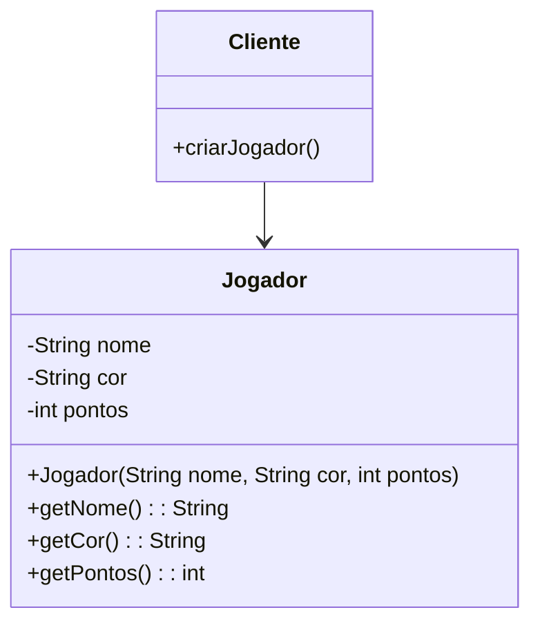
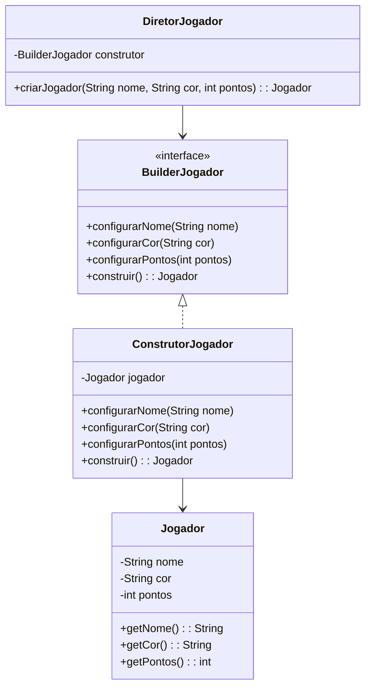
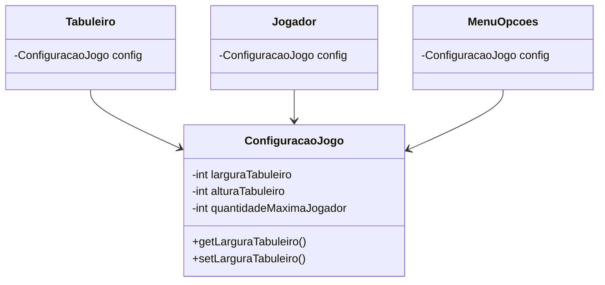

# Padrão Builder

## Intenção
 Separar a construção de um objeto complexo da sua representação de modo que o
 mesmo processo de construção possa criar diferentes representações - `GOF`

### Motivação

#### Cenário sem a aplicação do padrão

Durante o desenvolvimento de jogos, a criação de objetos como por exemplo Jogador pode ser complexa quando envolve múltiplos atributos e validações. Sem a aplicação do padrão Builder, ao realizar o instanciamento de um jogador seria feita diretamente através de um construtor com múltiplos parâmetros:

```java
Jogador jogador = new Jogador("Carlos", "Azul", 100);
```

**Diagrama UML (cenário sem o padrão):**



### Estrutura do padrão (GOF)


### Padrão aplicado no cenário

Aplicando o padrão Builder, a criação de Jogador é realizada passo a passo o que permiti a configuração de atributos obrigatórios e opcionais de uma forma clara e mais segura. O ConstrutorJogador implementa a interface BuilderJogador, fornecendo métodos para definir cada atributo. O DiretorJogador organiza a construção, garantindo que todas as etapas sejam seguidas de forma correta.

#### Classes envolvidas

- BuilderJogador    **-->** Interface 
- ConstrutorJogador **-->** Builder Concretos 
- DiretorJogador    **-->** Diretor
- Jogador           **-->** Objeto final

**Diagrama UML (cenário com o padrão):**



### Participantes

- Builder (BuilderJogador): Define a interface para construir diferentes partes do objeto Jogador

- ConcreteBuilder (ConstrutorJogador): Implementa a interface BuilderJogador que é responsável por construir o objeto Jogador

- Director (DiretorJogador): Controla o processo de construção, o que garante que os passos sejam seguidos corretamente

- Product (Jogador): O objeto complexo que está sendo construído

### Código (Framework)

**BuilderJogador**

```java
package builder;

import model.Jogador;

public interface BuilderJogador {
	void configurarNome(String nome);
	void configurarCor(String cor);
	void configurarPontos(int pontos);
	Jogador construir();
}
```

**DiretorJogador**

```java
package builder;

import model.Jogador;

public class DiretorJogador {

	private final ConstrutorJogador construtor;

	public DiretorJogador(ConstrutorJogador construtor) {
		this.construtor = construtor;
	}

	public Jogador criarJogador(String nome, String cor, int pontos) {
		construtor.configurarNome(nome);
		construtor.configurarCor(cor);
		construtor.configurarPontos(0);
		return construtor.construir();
	}
}
```


### Código (Jogo): 

COLOCAR
	


# Singleton

## Intenção
Garantir que apenas uma instância das configurações do jogo exista em toda a aplicação, fornecendo um acesso global e consistente a esses dados.

## Motivação
Em um jogo, é fundamental que configurações como o tamanho do tabuleiro e o número máximo de jogadores sejam definidas de forma centralizada. Se cada parte do jogo puder ter suas próprias configurações, surgirão inconsistências: um jogador pode estar em um tabuleiro de 7x9 enquanto outro está em um de 10x10, o que tornaria a experiência confusa e cheia de erros.

O padrão Singleton resolve esse problema ao garantir que haja apenas uma instância da configuração do jogo, acessível a todas as partes do sistema. Isso significa que todos compartilham os mesmos valores, e qualquer alteração é refletida em todo o jogo, mantendo a coerência.

Por exemplo, se o tabuleiro é 7x9, mas o sistema de colisões usa um grid de 10x12, isso pode resultar em bugs sérios, como jogadores aparecendo fora do mapa ou habilidades que funcionam em alguns módulos, mas falham em outros.

## Cenário sem o Padrão

## Diagrama UML (Padrão)
``` mermaid

 ```
## Padrão aplicado no cenário

No código fornecido, o padrão Singleton é aplicado para gerenciar as configurações globais do jogo:

- Garante que todas as partes do jogo acessem as mesmas configurações.
- Centraliza a gestão das configurações.
- Permite modificações globais quando necessário.

## Participantes

- **Singleton (ConfiguracaoJogo)** - mantém a única instância da classe e fornece acesso global.
  - Armazena os dados de configuração (quantidadeMaximaJogador, larguraTabuleiro, alturaTabuleiro).
  - Implementa o método getInstancia() para controle de acesso.

# Padrão Prototype
## Intenção
Permitir a criação de novos objetos através da clonagem de instâncias existentes, evitando a necessidade de subclasses para criação de objetos e fornecendo um mecanismo flexível para criação de objetos complexos.

## Motivação
Em um jogo de tabuleiro na selva, exploradores, animais e armadilhas precisam ser criados dinamicamente. O desafio é permitir a criação de novos tipos de peças sem repetir código ou dificultar a manutenção do jogo.
A solução está no uso de protótipos: em vez de criar cada peça do zero, o jogo pode clonar um modelo pré-existente. Assim, cada ferramenta do jogo gera novas peças a partir de um protótipo, tornando o código mais flexível.

### Cenário sem o Padrão
``` mermaid
classDiagram
    class Jogador
    class Posicao
    class Peca {
        +String tipo
        +int forca
        +Jogador jogador
        +Posicao posicao
        +novoElefante() Peca
        +novoLeao() Peca
    }
    
    Peca --> Jogador
    Peca --> Posicao
```
### Estrutura GOF


## Diagrama UML (Padrão)
``` mermaid
classDiagram
    class PecaPrototype {
        <<interface>>
        +clonar() PecaPrototype
        +getTipo() String
        +getForca() int
        +setPosicao(Posicao)
        +setJogador(Jogador)
        +podeCapturar(PecaPrototype) boolean
        +movimentoValido(Terreno,Posicao) boolean
    }
    
    class Peca {
        <<abstract>>
        -String tipo
        -int forca
        -Jogador jogador
        -Posicao posicao
        +clonar() PecaPrototype
        +getTipo() String
        +getForca() int
        +setPosicao(Posicao)
        +setJogador(Jogador)
    }
    
    class Elefante {
        +Elefante(Elefante)
    }
    
    class Leao {
        +Leao(Leao)
    }
    
    PecaPrototype <|.. Peca
    Peca <|-- Elefante
    Peca <|-- Leao
    Peca --> Jogador
    Peca --> Posicao
 ```
- Padrão aplicado no cenário:
Com a aplicação do padrão Prototype, cada tipo de peça pode ser criado a partir de um protótipo existente. Isso simplifica a criação de novas peças e reduz a duplicação de código. Por exemplo, ao clonar uma peça existente, todas as suas propriedades são copiadas automaticamente.

## Participante
- Prototype (PecaPrototype) Interface que define o método clonar() para permitir a clonagem de objetos.
- ConcretePrototype (Peca): Classe abstrata que implementa PecaPrototype e fornece a lógica para clonagem e atributos das peças.


# Padrão Facade  
## Intenção  

Fornecer uma interface unificada para um conjunto de interfaces em um subsistema. O Facade define uma interface de nível mais alto que torna o subsistema mais fácil de ser usado, reduzindo o acoplamento e organizando melhor as interações entre os componentes internos.

## Motivação  
Durante o desenvolvimento do jogo, notamos que várias partes do código interagiam diretamente com regras complexas, como validação de movimentos e verificação de vencedores. Isso tornava o código difícil de ler e manter. Para resolver isso, criamos a RegrasJogoFacade, que centraliza todas as regras do jogo em um único ponto, permitindo chamadas simples e diretas sem expor a lógica interna.  

### Antes do Facade  
O código precisava interagir diretamente com várias classes diferentes, o que aumentava a complexidade e dificultava futuras modificações.  


### Depois do Facade  
Agora, a RegrasJogoFacade encapsula toda a lógica e expõe apenas os métodos essenciais, como movimentoValido(), capturaValida() e verificarVencedor(). Isso torna o código mais limpo e fácil de manter.  

### Estrutura GOF


## Estrutura  
O Facade no projeto é composto por:  
- *RegrasJogoFacade (Interface)* → Define os métodos principais.  
- *RegrasJogoFacadeImpl (Implementação)* → Coordena as chamadas para componentes internos.  
- *GerenciadorTurnos, Tabuleiro, Peca, Jogador, etc.* → Componentes que lidam com regras específicas acessadas pela Facade.  

  

