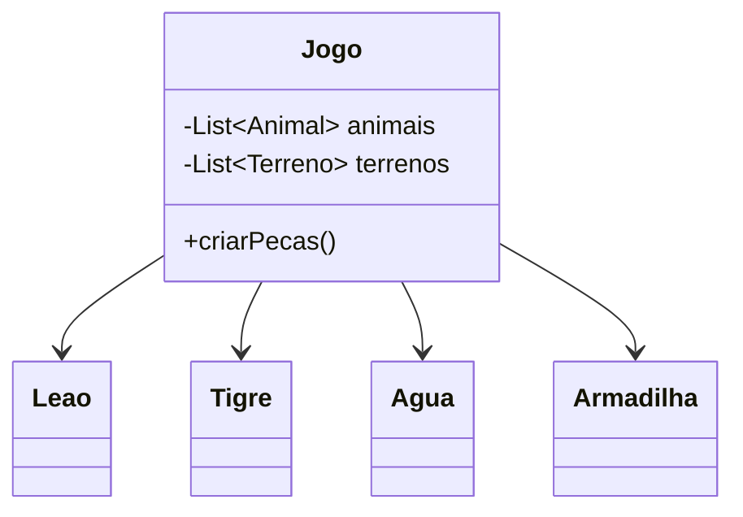
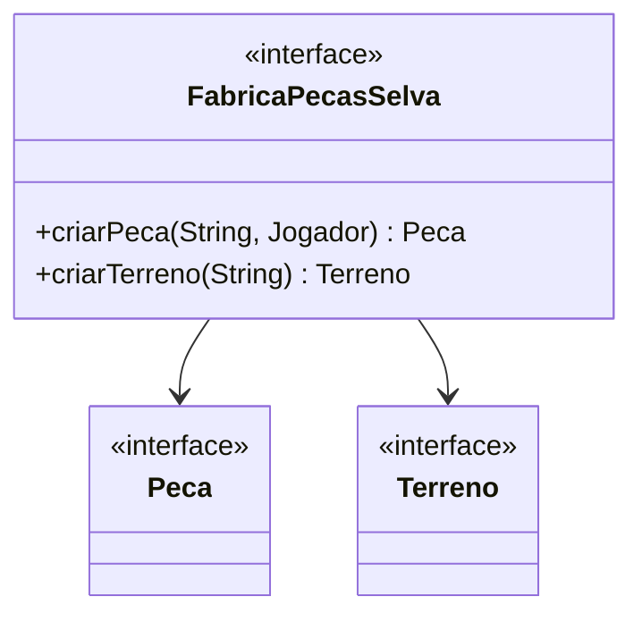

# Padrão Abstract Factory (Fábrica Abstrata)
## Intenção
Fornecer uma interface para criar famílias de objetos relacionados ou dependentes sem especificar suas classes concretas.

## Motivação
No desenvolvimento do Jogo da Selva, precisamos criar famílias de objetos, como animais e terrenos, que sejam consistentes em diferentes temas, como Realista, Cartoon e Pixel Art.
Sem um padrão, o código ficaria confuso e difícil de manter, tornando a troca de temas e a adição de novos estilos complicadas. Para resolver isso, usamos o padrão Abstract Factory.
Esse padrão define uma interface chamada FabricaPecasSelva, que inclui métodos como criarPeca() e criarTerreno(). Cada tema terá sua própria implementação dessa interface, garantindo que os objetos criados sejam sempre compatíveis com o estilo escolhido.

### Cenário sem o Padrão

### Diagrama UML (Padrão)

### Estrutura do Padrão (GOF)


## Participantes
- **AbstractFactory (FabricaPecasSelva):** Interface com métodos para criar produtos abstratos
- **ConcreteFactory:** Implementa a criação de produtos concretos
- **AbstractProduct (Peca, Terreno):** Interfaces dos produtos
- **ConcreteProduct (Leao, Agua):**  define um objeto-produto a ser criado pela correspondente fábrica concreta.


# Padrão Builder

## Intenção
O padrão Builder tem como objetivo principal simplificar a construção de objetos complexos que exigem múltiplos parâmetros, alguns obrigatórios e outros opcionais. 
Em vez de depender de construtores sobrecarregados ou métodos setters que podem deixar o objeto em estado inconsistente, o Builder oferece uma abordagem mais organizada e segura. 
Ele permite configurar o objeto passo a passo, garantindo que todas as validações necessárias sejam aplicadas antes que a instância final seja criada.

## Motivação
Na construção de sistemas de jogos, frequentemente nos deparamos com a necessidade de criar objetos complexos como personagens jogáveis. 
Esses objetos geralmente possuem uma variedade de atributos, alguns essenciais e outros opcionais, cada um com suas próprias regras de validação.
O principal desafio surge quando tentamos criar esses objetos usando abordagens convencionais. Construtores com múltiplos parâmetros rapidamente se tornam difíceis de gerenciar e entender. 
Imagine um construtor que precise aceitar nome, cor, pontos iniciais, nível, habilidades especiais e equipamentos - rapidamente teríamos um método confuso e propenso a erros. 
Alternativas como usar setters após a criação também apresentam problemas, pois permitem que o objeto exista em estados inconsistentes durante sua construção.

### Cenário sem o Padrão

### Diagrama UML (Padrão)

## Participantes

- **Builder (BuilderJogador):** Define a interface para construir diferentes partes do objeto Jogador. Fornece os métodos abstratos para personalização (`comNome()`, `comCor()`, etc.).

- **ConcreteBuilder (ConstrutorJogador):** Aqui temos a implementação concreta do Builder. O ConstrutorJogador é encarregado de construir o objeto Jogador de fato. Ele mantém a representação do jogador em um atributo interno e oferece métodos específicos para configurar suas propriedades, como `comNome()`, `comCor()` e `comPontos()`. Após definir todas as características desejadas, o método `construir()` é chamado para retornar o objeto Jogador completamente configurado e pronto para uso.

- **Director (DiretorJogador):** Garante que os passos de construção sejam seguidos corretamente. Utiliza um Builder para criar um Jogador com configurações específicas.

- **Product (Jogador):** O objeto complexo que está sendo construído.


# Singleton

## Intenção
Garantir que apenas uma instância das configurações do jogo exista em toda a aplicação, fornecendo um acesso global e consistente a esses dados.

## Motivação
Em um jogo, é fundamental que configurações como o tamanho do tabuleiro e o número máximo de jogadores sejam definidas de forma centralizada. Se cada parte do jogo puder ter suas próprias configurações, surgirão inconsistências: um jogador pode estar em um tabuleiro de 7x9 enquanto outro está em um de 10x10, o que tornaria a experiência confusa e cheia de erros.

O padrão Singleton resolve esse problema ao garantir que haja apenas uma instância da configuração do jogo, acessível a todas as partes do sistema. Isso significa que todos compartilham os mesmos valores, e qualquer alteração é refletida em todo o jogo, mantendo a coerência.

Por exemplo, se o tabuleiro é 7x9, mas o sistema de colisões usa um grid de 10x12, isso pode resultar em bugs sérios, como jogadores aparecendo fora do mapa ou habilidades que funcionam em alguns módulos, mas falham em outros.

## Cenário sem o Padrão

## Diagrama UML (Padrão)
```mermaid

 ```
## Padrão aplicado no cenário

No código fornecido, o padrão Singleton é aplicado para gerenciar as configurações globais do jogo:

- Garante que todas as partes do jogo acessem as mesmas configurações.
- Centraliza a gestão das configurações.
- Permite modificações globais quando necessário.

## Participantes

- **Singleton (ConfiguracaoJogo)** - mantém a única instância da classe e fornece acesso global.
  - Armazena os dados de configuração (`quantidadeMaximaJogador`, `larguraTabuleiro`, `alturaTabuleiro`).
  - Implementa o método `getInstancia()` para controle de acesso.
