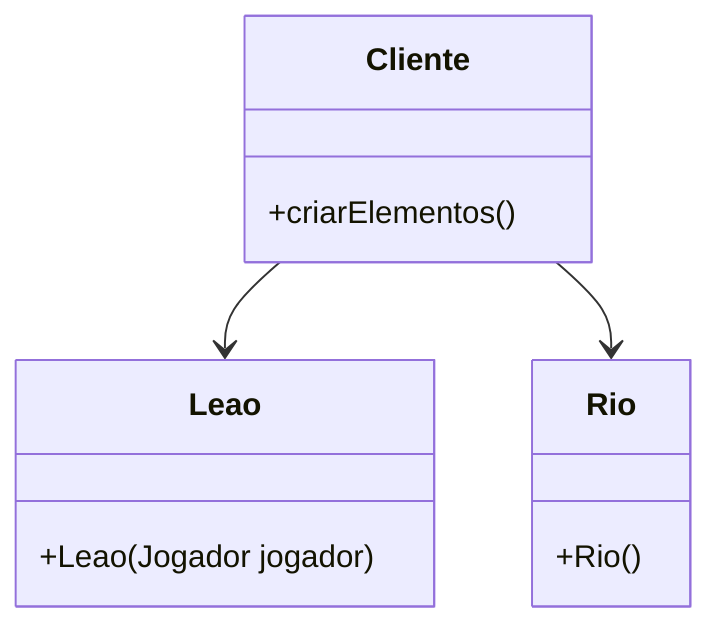
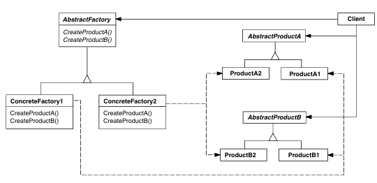
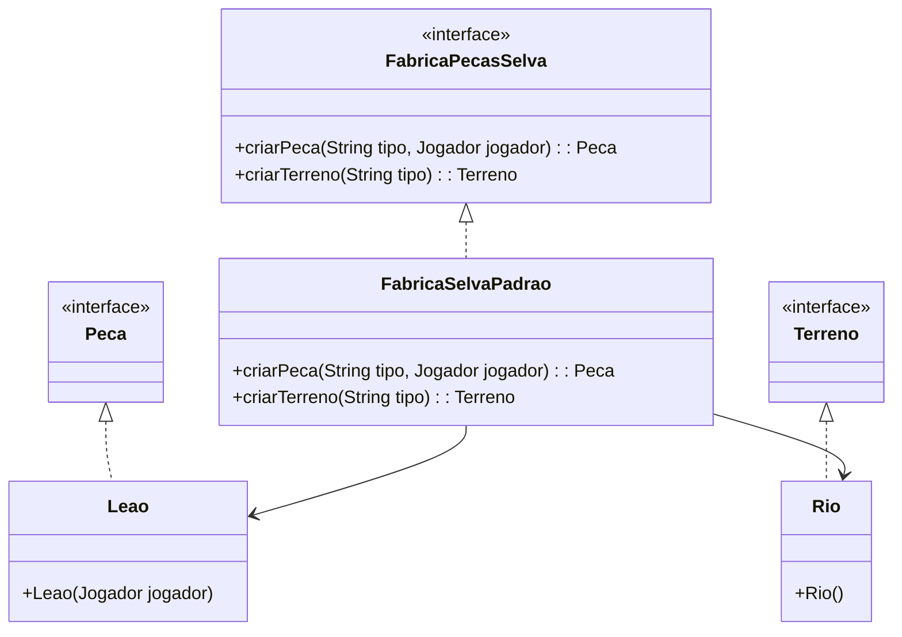

# Padrão Abstract Factory

## Intenção
Fornecer uma interface para criação de famílias de objetos relacionados ou dependentes sem especificar suas classes concretas.  - `GOF`

## Motivação

### Cenário sem a aplicação do padrão

No desenvolvimento de jogos de tabuleiro, a criação de elementos específicos é essencial. Sem o uso do padrão Abstract Factory, a instânciação direta dessas classes pode levar a um código fortemente acoplado e difícil de manter. Por exemplo:

```java
Peca peca = new Leao(jogador);
Terreno terreno = new Rio();
```

desta forma exigindo que o código cliente conheça as classes concretas, tornando o sistema menos flexível a mudanças, como a introdução de novos elementos.

**Diagrama UML (cenário sem o padrão):**



### Estrutura do padrão (GoF)



## Padrão aplicado no cenário

### Descrição textual

Aplicando o padrão Abstract Factory ao jogo Selva, criamos uma interface FabricaPecasSelva que define métodos para criar peças e terrenos. Implementações concretas dessa fábrica, como FabricaSelvaPadrao, são responsáveis por instanciar objetos específicos (Leao,Rio, entre outros). Isso permite que o código cliente utilize a fábrica para criar objetos sem depender de classes concretas, facilitando a manutenção e expansão do sistema.

### Classes envolvidas

- FabricaPecasSelva **-->** Interface 
- FabricaSelvaPadrao **-->**  Implementação concreta do jogo especifico
- Peca **-->** Implementação concreta de peças especificas
- Terreno **-->** Interface ou classe base para o tabulerio
- Leao, Tigre, Elefante **-->**  Implementações concretas de Peca
- Rio, Floresta, Montanha, **-->**Implementações concretas de Terreno.

**Diagrama UML (cenário com o padrão):**



## Participantes

- AbstractFactory (FabricaPecasSelva): Define a interface para criação de objetos.
- ConcreteFactory (FabricaSelvaPadrao): Implementa a interface FabricaPecasSelva, criando objetos específicos do jogo.
- AbstractProduct (Peca, Terreno): Interfaces ou classes base para os produtos criados.
- ConcreteProduct (Leao, Rio, etc.): Implementações concretas dos produtos.

## Código

### Framework

**FabricaPecasSelva.java**

```java
package abstractFactory;

import model.Jogador;
import model.Terreno;
import model.pecas.Peca;

public interface FabricaPecasSelva {
    Peca criarPeca(String tipo, Jogador jogador);
    Terreno criarTerreno(String tipo);
}
```

**FabricaSelvaPadrao.java**

```java
package abstractFactory;

import model.Jogador;
import model.Terreno;
import model.pecas.*;

public class FabricaSelvaPadrao implements FabricaPecasSelva {

    @Override
    public Peca criarPeca(String tipo, Jogador jogador) {
        switch (tipo) {
            case "Leão": return new Leao(jogador);
            case "Tigre": return new Tigre(jogador);
            case "Elefante": return new Elefante(jogador);
            case "Leopardo": return new Leopardo(jogador);
            case "Cão": return new Cao(jogador);
            case "Lobo": return new Lobo(jogador);
            case "Gato": return new Gato(jogador);
            case "Rato": return new Rato(jogador);
            default:
                throw new IllegalArgumentException("Tipo de peça desconhecido: " + tipo);
        }
    }

    @Override
    public Terreno criarTerreno(String tipo) {
        switch (tipo) {
            case "Rio": return new Rio();
            case "Floresta": return new Floresta();
            case "Montanha": return new Montanha();
            default:
                throw new IllegalArgumentException("Tipo de terreno desconhecido: " + tipo);
        }
    }
}
```


### Código (Jogo): 

COLOCAR
    