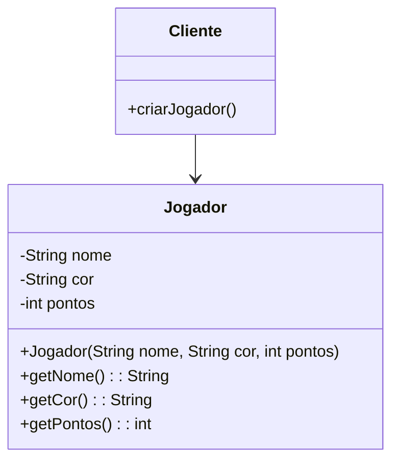
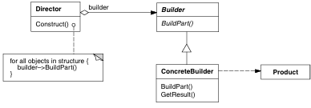
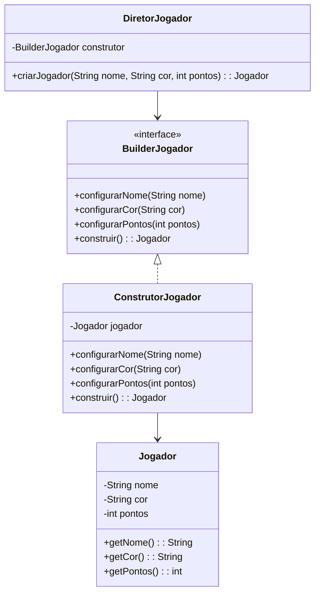

# Padrão Builder

## Intenção
 Separar a construção de um objeto complexo da sua representação de modo que o
 mesmo processo de construção possa criar diferentes representações - `GOF`

### Motivação

#### Cenário sem a aplicação do padrão

Durante o desenvolvimento de jogos, a criação de objetos como por exemplo Jogador pode ser complexa quando envolve múltiplos atributos e validações. Sem a aplicação do padrão Builder, ao realizar o instanciamento de um jogador seria feita diretamente através de um construtor com múltiplos parâmetros:

```java
Jogador jogador = new Jogador("Carlos", "Azul", 100);
```

**Diagrama UML (cenário sem o padrão):**



### Estrutura do padrão (GOF)



### Padrão aplicado no cenário

Aplicando o padrão Builder, a criação de Jogador é realizada passo a passo o que permiti a configuração de atributos obrigatórios e opcionais de uma forma clara e mais segura. O ConstrutorJogador implementa a interface BuilderJogador, fornecendo métodos para definir cada atributo. O DiretorJogador organiza a construção, garantindo que todas as etapas sejam seguidas de forma correta.

#### Classes envolvidas

- BuilderJogador    **-->** Interface 
- ConstrutorJogador **-->** Builder Concretos 
- DiretorJogador    **-->** Diretor
- Jogador           **-->** Objeto final

**Diagrama UML (cenário com o padrão):**



### Participantes

- Builder (BuilderJogador): Define a interface para construir diferentes partes do objeto Jogador

- ConcreteBuilder (ConstrutorJogador): Implementa a interface BuilderJogador que é responsável por construir o objeto Jogador

- Director (DiretorJogador): Controla o processo de construção, o que garante que os passos sejam seguidos corretamente

- Product (Jogador): O objeto complexo que está sendo construído

### Código (Framework)

**BuilderJogador**

```java
package builder;

import model.Jogador;

public interface BuilderJogador {
    void configurarNome(String nome);
    void configurarCor(String cor);
    void configurarPontos(int pontos);
    Jogador construir();
}
```

**DiretorJogador**

```java
package builder;

import model.Jogador;

public class DiretorJogador {

    private final ConstrutorJogador construtor;

    public DiretorJogador(ConstrutorJogador construtor) {
        this.construtor = construtor;
    }

    public Jogador criarJogador(String nome, String cor, int pontos) {
        construtor.configurarNome(nome);
        construtor.configurarCor(cor);
        construtor.configurarPontos(0);
        return construtor.construir();
    }
}
```


### Código (Jogo): 

COLOCAR
    