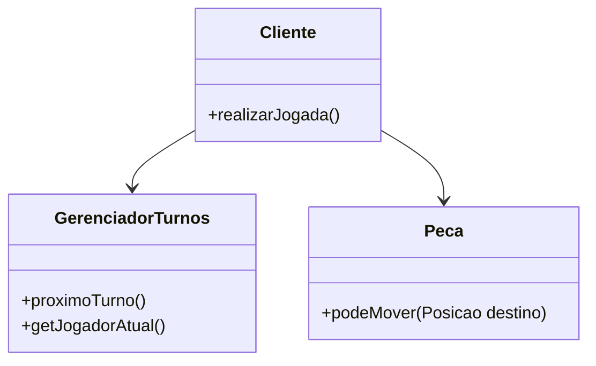
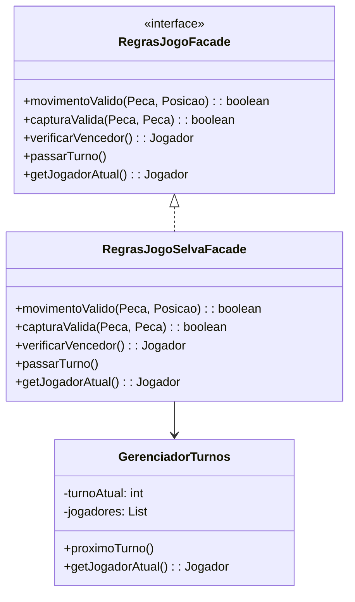

# Padrão Facade

## Intenção

Fornecer uma interface unificada para um conjunto de interfaces em um subsistema. O Facade define uma interface de nível mais alto que torna o subsistema mais fácil de usar. – `GoF`


## Motivação

### Cenário sem a aplicação do padrão

Sem o uso do padrão Facade, o código cliente precisa interagir diretamente com diversos componentes internos do jogo, como o controle de turnos, as regras de movimentação e captura. Isso gera um forte acoplamento e maior complexidade no código:

```java
if (peca.podeMover(destino) && regrasJogo.capturaValida(peca, inimigo)) {
    gerenciadorTurnos.proximoTurno();
}
```

Nesse cenário, o cliente precisa conhecer múltiplas classes e suas interações internas, o que torna a manutenção e a extensão do sistema mais difíceis.

**Diagrama UML (cenário sem o padrão):**




### Estrutura do padrão (GoF)


## Padrão aplicado no cenário

### Descrição textual

Ao aplicarmos o padrão Facade ao jogo Selva, criamos uma interface RegrasJogoFacade esta encapsula a lógica de movimentação, captura e controle de turnos. O cliente por sua vez ao invés de lidar com diversas classes diretamente, interage com essa fachada única.Reduzindo o acoplamento, melhorando a organização e facilitando modificações futuras.


### Classes envolvidas

- RegrasJogoFacade **-->** Interface
- RegrasJogoSelvaFacade **-->** Implementação concreta
- GerenciadorTurnos **-->** Subsistema interno de controle de turnos
- Peca, Posicao, Jogador **-->** Entidades do jogo que participam das regras

**Diagrama UML (cenário com o padrão):**




## Participantes

- Facade (RegrasJogoFacade): Interface unificada para operações de turno, movimento e regras do jogo.
- ConcreteFacade (RegrasJogoSelvaFacade): Implementação concreta da interface, orquestra as operações internas.
- Subsistemas (GerenciadorTurnos, Peca): Componentes internos encapsulados pela fachada.
- Cliente: Interage apenas com a fachada, sem conhecer os detalhes internos.


## Código

### Framework

**GerenciadorTurnos.java**

```java
package framework.facade;

import java.util.List;
import framework.model.Jogador;

public class GerenciadorTurnos {
    private int turnoAtual;
    private List<Jogador> jogadores;

    public GerenciadorTurnos(List<Jogador> jogadores) {
        if (jogadores == null || jogadores.isEmpty()) {
            throw new IllegalArgumentException("Lista de jogadores não pode ser vazia");
        }
        this.jogadores = jogadores; 
        this.turnoAtual = 0;
    }

    public void proximoTurno() {
        turnoAtual = (turnoAtual + 1) % jogadores.size();
    }

    public Jogador getJogadorAtual() {
        return jogadores.get(turnoAtual); 
    }
}
```

**RegrasJogoFacade.java**

```java
package framework.facade;

import framework.model.Jogador;
import framework.model.Posicao;
import framework.model.pecas.Peca;

public interface RegrasJogoFacade {
    boolean movimentoValido(Peca peca, Posicao destino);
    boolean capturaValida(Peca atacante, Peca defensor);
    Jogador verificarVencedor();
    void passarTurno();
    Jogador getJogadorAtual();
}
```

### Código (Jogo): 

COLOCAR
	