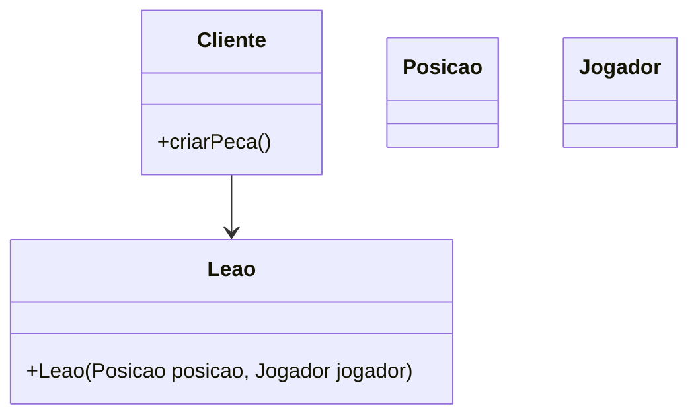
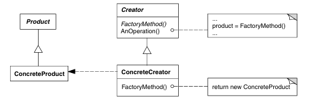
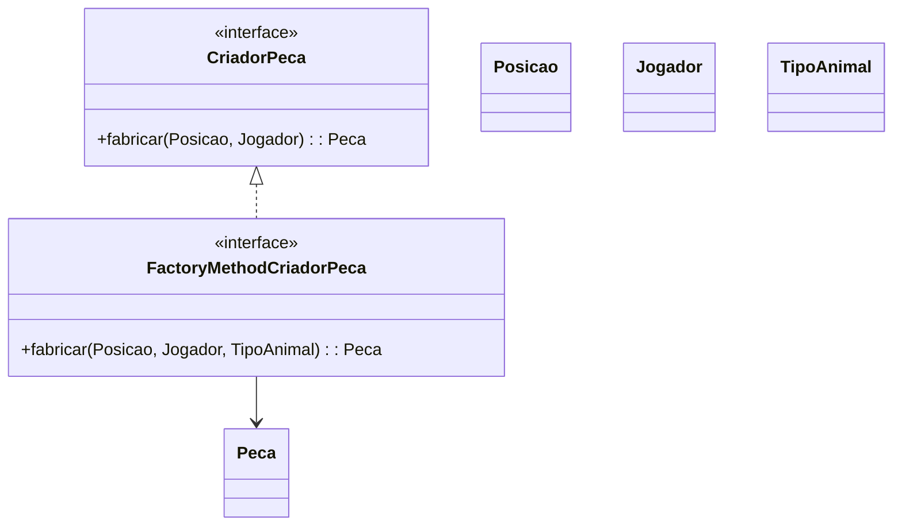

# Padrão Factory Method

## Intenção  
Definir uma interface para criar um objeto, mas deixar as subclasses decidirem qual classe instanciar. O Factory Method permite adiar a instanciação para as subclasses. – `GOF`

## Motivação

### Cenário sem a aplicação do padrão

Ao criar diferentes peças em um jogo, como leões, tigres ou ratos, o código pode ficar fortemente acoplado às classes concretas dessas peças:

```java
Peca peca = new Leao(new Posicao(0, 0), jogador);
```

O que acaba dificultando a manutenção e a expansão, tornando mais difícil mudar o comportamento da criação de peças no futuro, além de quebrar o princípio aberto-fechado.

**Diagrama UML (cenário sem o padrão):**



---

## Estrutura do padrão (GOF)



---

## Padrão aplicado no cenário

### Descrição textual

Aplicando o padrão Factory Method no framework, criamos a interface CriadorPeca, que define o contrato para a criação de peças. A interface estendida FactoryMethodCriadorPeca adiciona suporte para criação de peças com base em um tipo específico TipoAnimal. Isso permite que as subclasses implementem a lógica específica para instanciar peças de forma flexível, encapsulando o processo de criação.


### Classes envolvidas

- CriadorPeca → Interface 
- FactoryMethodCriadorPeca → Interface especializada do método fábrica
- Peca → Produto
- Posicao, Jogador, TipoAnimal → Parâmetros utilizados na criação da peça

**Diagrama UML (cenário com o padrão):**



## Participantes

- Creator (CriadorPeca): Declara o método de fábrica que retorna objetos do tipo Peca.
- ConcreteCreator (FactoryMethodCriadorPeca): Especializa a criação do produto com base em TipoAnimal, permitindo maior flexibilidade.
- Product (Peca): Define a interface comum para os objetos que serão criados.
- Client: Usa o método fábrica sem depender de implementações concretas das peças.

---

### Código (Framework)

**CriadorPeca.java**

```java
package framework.factoryMethod;

import framework.model.Jogador;
import framework.model.Posicao;
import framework.model.pecas.Peca;

public interface CriadorPeca {
    Peca fabricar(Posicao posicao, Jogador jogador);
}
```

**FactoryMethodCriadorPeca.java**

```java
package framework.factoryMethod;

import framework.model.Jogador;
import framework.model.Posicao;
import framework.model.pecas.Peca;
import framework.model.pecas.TipoAnimal;

public interface FactoryMethodCriadorPeca extends CriadorPeca {
    Peca fabricar(Posicao posicao, Jogador jogador, TipoAnimal animal);
}
```

---

### Código (Jogo):

COLOCAR

---

Se quiser, posso escrever uma implementação concreta de `FactoryMethodCriadorPeca` também — por exemplo, uma fábrica de peças do tipo animal. Quer que eu faça isso?