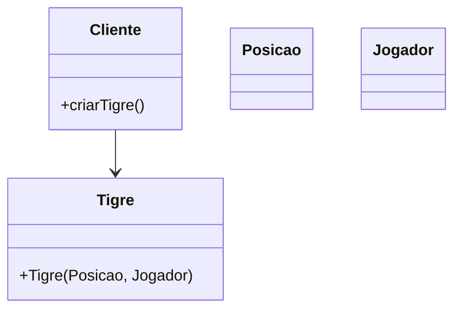
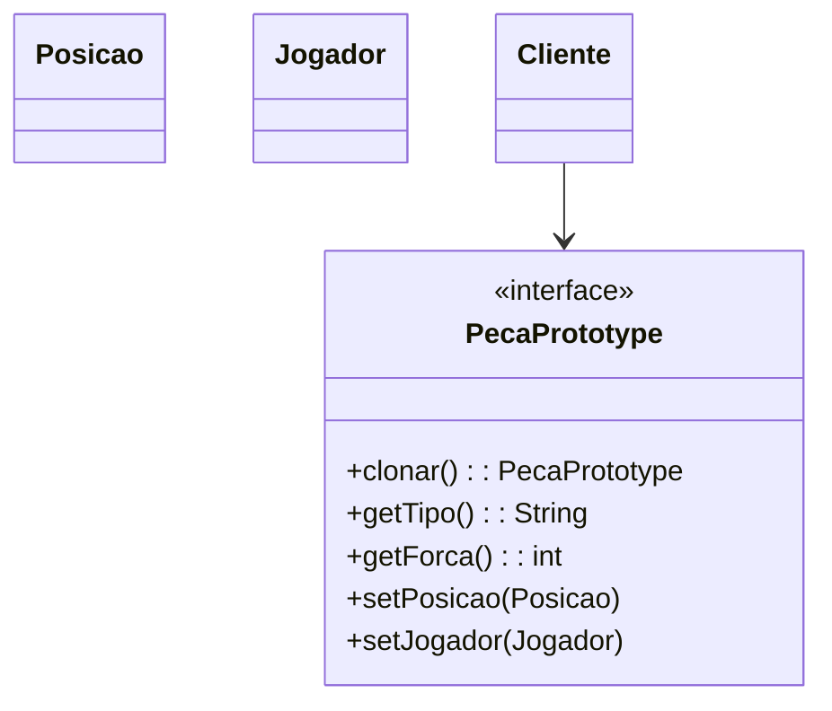

Claro! Aqui está a documentação completa para o padrão **Prototype**, seguindo exatamente o modelo que você forneceu antes:

---

# Padrão Prototype

## Intenção  
Especificar os tipos de objetos a serem criados usando uma instância prototípica e criar novos objetos copiando esse protótipo. – `GOF`

---

## Motivação

### Cenário sem a aplicação do padrão

A criação de peças exige configurações e estados complexos. Sem o uso do padrão Prototype, cada nova peça precisa ser criada do zero com todas as configurações, o que pode tornar o processo custoso em termos de desempenho e legibilidade:

```java
Peca tigre = new Tigre(new Posicao(2, 2), jogador);
```

 O que torna a duplicação de objetos semelhante mais difícil, especialmente quando eles compartilham a mesma configuração básica.

**Diagrama UML (cenário sem o padrão):**



---

## Estrutura do padrão (GOF)


---

## Padrão aplicado no cenário

### Descrição textual

Com o padrão Prototype, definimos a interface PecaPrototype, que oferece um método clonar(). Cada peça concreta poderá ser clonada a partir de um protótipo existente, permitindo criar novos objetos com base em um modelo já configurado. Isso reduz o custo de criação e facilita a replicação de peças semelhantes com pequenas variações.

---

### Classes envolvidas

- PecaPrototype **-->**  Interface
- Posicao, Jogador **-->**  Parâmetros de estado
- Peças concretas **-->**  Protótipos clonáveis
- clonar() **-->**  Método principal para duplicar

**Diagrama UML (cenário com o padrão):**



---

## Participantes

- Prototype (PecaPrototype): Interface para clonagem de si mesmo.
- ConcretePrototype (ex: Tigre, Rato): Implementa a clonagem de si mesmo, retornando uma nova instância com o mesmo estado.
- Client: Usa o protótipo para clonar novos objetos sem depender diretamente de suas classes concretas.


### Código (Framework)

**PecaPrototype.java**

```java
package framework.prototype;

import framework.model.Jogador;
import framework.model.Posicao;

public interface PecaPrototype extends Cloneable {
    PecaPrototype clonar();  
    String getTipo();      
    int getForca();
    void setPosicao(Posicao posicao);
    void setJogador(Jogador jogador);
}
```

### Código (Jogo):

COLOCAR